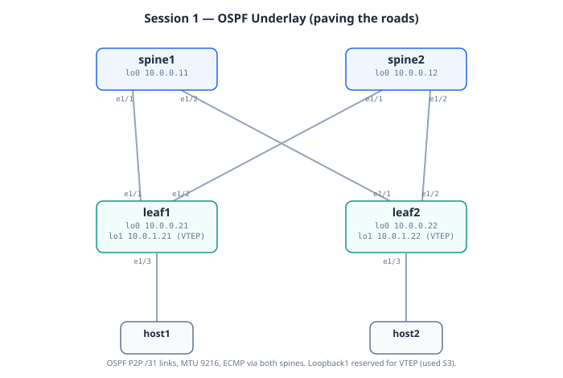

# Session 1: Underlay with OSPF

**Prerequisites**: Session 0 complete, lab platform ready.

**Goal**: Build IP reachability between every device's loopback. By the
end, leaf1's loopback can ping spine2's loopback, and you understand why
that mattered.

**Lab folder**: [`labs/01-underlay`](../labs/01-underlay/)

**Estimated time**: 45 minutes including verification and break-it
exercises.

---

## Bring-up

This is the **first deploy of the base fabric** (Model A — see
[`DEPLOYMENT.md`](DEPLOYMENT.md)). Sessions 1–7 all run on this same
running lab; you deploy once here, then advance with `switch.sh`.

```bash
cd ~/vxlan-evpn-zero-to-hero

# Boot the base fabric (nodes come up with blank NX-OS).
# ~15 min for the four N9000v.
./scripts/deploy.sh 01-underlay

# Wait until every n9kv shows (healthy):
watch -n 10 'docker ps --format "{{.Names}}\t{{.Status}}" | grep clab-vxlan'

# Push the Session 1 configs onto the booted nodes:
./scripts/switch.sh 01-underlay
```

No host setup needed this session — Session 1 is underlay-only.
When done studying, do **not** destroy: Session 2 continues on this
running lab with `./scripts/switch.sh 02-overlay`.

## Topology (this session)



*(Rendered diagram above; the ASCII version below is the text fallback.)*


```
      +----------------+            +----------------+
      |     spine1     |            |     spine2     |
      | lo0 10.0.0.11  |            | lo0 10.0.0.12  |
      +----------------+            +----------------+
       Eth1/1    Eth1/2              Eth1/1    Eth1/2
          |          \                  /         |
          |           \                /          |
          |            \              /           |
          |             +--- X ------+            |
          |            /              \           |
       Eth1/1     Eth1/2           Eth1/1      Eth1/2
      +----------------+            +----------------+
      |     leaf1      |            |     leaf2      |
      | lo0 10.0.0.21  |            | lo0 10.0.0.22  |
      | lo1 10.0.1.21  |            | lo1 10.0.1.22  |
      +----------------+            +----------------+
        Eth1/3                        Eth1/3
          |                             |
       +-------+                     +-------+
       | host1 |                     | host2 |
       +-------+                     +-------+
```

| Link | A-side | B-side | Notes |
|------|--------|--------|-------|
| spine1–leaf1 | spine1 Eth1/1 | leaf1 Eth1/1 | P2P /31, OSPF |
| spine1–leaf2 | spine1 Eth1/2 | leaf2 Eth1/1 | P2P /31, OSPF |
| spine2–leaf1 | spine2 Eth1/1 | leaf1 Eth1/2 | P2P /31, OSPF |
| spine2–leaf2 | spine2 Eth1/2 | leaf2 Eth1/2 | P2P /31, OSPF |
| leaf1–host1  | leaf1 Eth1/3  | host1 eth1   | host attach |
| leaf2–host2  | leaf2 Eth1/3  | host2 eth1   | host attach |
| leaf1–leaf2  | leaf1 Eth1/4  | leaf2 Eth1/4 | **dormant until S6** (peer-link) |
| leaf1–leaf2  | leaf1 Eth1/5  | leaf2 Eth1/5 | **dormant until S6** (keepalive) |
| leaf2–host1  | leaf2 Eth1/6  | host1 eth2   | **dormant until S6** (bond NIC 2) |

Exact link IPs: [`common/ipplan.md`](../common/ipplan.md). The three
dormant links are physically wired from day one so Sessions 6+ need no
topology change.

---

## Mental model

Before any config, picture what we're building.

Imagine the fabric as a **highway system**. The leaves are towns where
people live (the hosts). The spines are highway interchanges. Every town
has on-ramps to every interchange, so you can drive from any town to any
other town through at least two different interchanges.

In this session we're just **paving the roads**. We don't care yet who
drives on them or where they're going. We just need every town to know
how to reach every other town's address, with backup paths in case one
interchange closes for repairs.

The cars (VXLAN packets) come later. The cargo (tenant traffic) comes
after that. But none of it matters until the roads are paved and
everyone knows the map.

OSPF is how we make every device share its piece of the map. By the end
of this session, every device will know how to reach every other
device's loopback IP, with two paths to choose from for redundancy.

> **Key insight**: The underlay is deliberately boring. The whole point
> is that it just works in the background while VXLAN does the
> interesting things on top. If the underlay ever becomes
> "interesting," something has gone wrong.

---

## Why we need an underlay at all

VXLAN is a tunnel protocol. To send a frame from host1 (behind leaf1) to
host2 (behind leaf2), leaf1 wraps the frame in a UDP packet addressed to
leaf2's VTEP IP. That UDP packet then travels across the fabric like
any other IP packet.

For this to work, **every leaf must be able to reach every other leaf's
VTEP IP**. That's the only job of the underlay: provide loss-free,
loop-free IP transport between leaves, with multiple equal-cost paths
through the spines.

The underlay doesn't know about VLANs, MAC addresses, or tenants. It's
pure IP. Think of it as the highway. The overlay (VXLAN-EVPN) is the
cargo moving across it.

## Why OSPF for now

We have three reasonable choices for an underlay protocol:

| Protocol     | Pro                                            | Con                                          |
|--------------|------------------------------------------------|----------------------------------------------|
| OSPF         | Simple, fast convergence, single area is fine  | Doesn't scale beyond ~few hundred devices    |
| IS-IS        | Same as OSPF, slightly more elegant            | Less common in enterprise muscle memory      |
| eBGP per node| Scales to huge fabrics, used by hyperscalers   | More configuration, ASN management overhead  |

For learning, OSPF is the right starting point: it's mechanically simple
and the verification commands are easy to read. We'll **refactor to
eBGP in session 7** once you understand the rest of the stack — at that
point you'll see why production fabrics drop OSPF.

> **Real-world note:** Cisco's reference design for VXLAN-EVPN
> ("VXLAN BGP EVPN Configuration Guide") uses OSPF in its examples.
> Meta and Microsoft Azure use eBGP. Both work. The choice depends on
> fabric size and your operations team's preference.

## The IP plan recap

From [`common/ipplan.md`](../common/ipplan.md):

- **Loopback0** (router-id): `10.0.0.<device-id>/32`
- **Loopback1** (VTEP source, leaves only): `10.0.1.<device-id>/32`
- **P2P /31 links**: `10.10.<link-id>.0/31`, spine side `.0`, leaf side `.1`

We're configuring **both** Loopback0 and Loopback1 in this session, even
though Loopback1 doesn't serve a purpose yet. Reason: when we add NVE
in session 3, the VTEP IPs are already reachable across the underlay.
No retro-fitting.

## Design decisions in the underlay config

A few choices in the configs deserve explanation before you read them.

### Decision 1: /31 instead of /30 on P2P links

Old-school CCNA teaches /30 for point-to-point (4 IPs, 2 usable, 2 wasted
on network/broadcast). RFC 3021 made /31 legal on P2P interfaces — both
addresses become usable. We use /31:

- Saves half the IP space (not that we're short)
- One less broadcast address per link, marginally safer
- Reading `10.10.1.0` immediately tells you "spine side", `10.10.1.1`
  tells you "leaf side"

Both NX-OS and IOS-XE accept /31 fine on routed interfaces.

### Decision 2: `ip ospf network point-to-point`

By default, OSPF on Ethernet runs in "broadcast" mode, which elects a
DR (Designated Router) and BDR. On a real point-to-point link with only
two routers, DR election is pointless overhead and adds 30+ seconds to
convergence.

`ip ospf network point-to-point` tells OSPF "treat this like a serial
link — no DR, just exchange LSAs directly with the neighbor."

You'll see this on every routed P2P interface in the fabric.

### Decision 3: MTU 9216 everywhere on the underlay

VXLAN adds **50 bytes of overhead** to every packet (outer Ethernet 14 +
outer IP 20 + outer UDP 8 + VXLAN 8 = 50). A 1500-byte tenant frame
becomes a 1550-byte underlay packet. With default 1500 MTU underlay,
you'd fragment every VXLAN packet — performance disaster.

Solution: jumbo frames everywhere in the underlay. 9216 is the Nexus
default maximum and is plenty.

This **must** be configured on every P2P interface in the underlay.
Missing it on one link is the single most common VXLAN deployment bug
in production.

### Decision 4: Single area (Area 0) for the entire fabric

OSPF areas were designed for scaling — limit LSA propagation between
areas via ABRs. A 4-node fabric doesn't need areas. Single backbone
area, all interfaces in it, done.

When does this stop working? Around 50-100 devices in one OSPF area
you start seeing LSA flood storms during convergence. That's the
moment you either add areas (ugly with VXLAN) or switch to BGP underlay
(session 7).

## Deploying the lab

From the repo root:

```bash
./scripts/deploy.sh 01-underlay
```

What happens:

1. Containerlab reads `labs/01-underlay/topology.clab.yml`.
2. It pulls the `cisco_n9kv` image (already built locally from session 0)
   and the `alpine:latest` image for the hosts.
3. Each node boots — for Nexus 9000v this is a real qcow2 boot, taking
   5-10 minutes per node, partially in parallel.
4. Once each node is responsive, containerlab pushes the matching
   `.cfg` file from `configs/` as the startup config.
5. When deploy completes, you get a summary table with management IPs.

While it boots, you can watch one node's console:

```bash
docker logs -f clab-vxlan-evpn-spine1
```

Press Ctrl-C to detach.

## Logging into a device

After deploy:

```bash
ssh admin@clab-vxlan-evpn-spine1
```

Password: `admin` (vrnetlab default for cisco_n9kv).

You'll land in the NX-OS exec prompt. From here all the standard
`show` commands work.

## What to verify

See [`labs/01-underlay/verify.md`](../labs/01-underlay/verify.md) for
the full checklist. The headline checks:

1. All 4 OSPF neighbor relationships are FULL.
2. Every device sees all 4 loopbacks in its route table.
3. Pings between any two loopbacks succeed.
4. MTU on every underlay interface is 9216.

## What to break

See [`labs/01-underlay/break-it.md`](../labs/01-underlay/break-it.md).
Quick preview:

- Shut a spine-leaf link, watch OSPF reconverge through the other spine.
- Change MTU on one side of a link, watch the neighbor relationship
  flap (subtle MTU mismatch bug — the classic real-world VXLAN failure).

## What you should be able to explain after this session

If you can answer these out loud, you've got it:

1. Why do we run a routing protocol between the leaves and spines at
   all? Why not just configure static routes?
2. What is the VTEP IP and why is it a /32 on a loopback instead of
   on a physical interface?
3. Why do we set `ip ospf network point-to-point` on P2P links?
4. What happens if one of the four P2P links has MTU 1500 while the
   rest are 9216? (Hint: OSPF might stay up, but VXLAN data plane
   will silently drop or fragment.)
5. Why do we configure Loopback1 now even though we haven't enabled
   NVE yet?

If you can't answer one of these, re-read the relevant section above
before moving to session 2.

## Tearing down

```bash
./scripts/reset.sh 01-underlay
```

This destroys and redeploys the lab to a clean state. If you just want
to destroy without redeploying:

```bash
containerlab destroy -t labs/01-underlay/topology.clab.yml --cleanup
```

The `--cleanup` flag removes the auto-generated lab directory under
`labs/01-underlay/clab-vxlan-evpn/` which contains runtime artifacts.

## Next

**Session 2**: BGP EVPN overlay. We turn the spines into route
reflectors and bring up iBGP sessions from leaves to spines. The
underlay carries the iBGP sessions; the iBGP sessions will (in
session 3) carry the EVPN routes.
