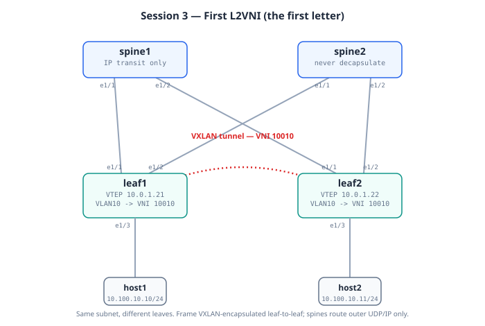

# Session 3: The First L2VNI

**Prerequisites**: Sessions 1 and 2 complete. OSPF underlay healthy, BGP
EVPN sessions Established with PfxRcd=0 on every peer.

**Goal**: Stretch one VLAN across two leaves using a VXLAN tunnel, and
ping between two hosts that think they're on the same L2 segment but
are actually 5+ hops apart through the fabric.

**Lab folder**: [`labs/03-l2vni`](../labs/03-l2vni/)

**Estimated time**: 50 minutes. This is the longest session so far
because there are several new concepts and you'll spend real time on
the verification (which is genuinely fun this session).

---

## Bring-up

**Recommended (Model A chain)** — push onto the running lab:

```bash
cd ~/vxlan-evpn-zero-to-hero
./scripts/switch.sh 03-l2vni
# After the push, switch.sh prints this session's host-setup commands
# (host1/host2 IPs in 10.100.10.0/24) and the test ping. Run those.
```

**Alternative (standalone)**: destroy the running lab, then
`./scripts/deploy.sh 03-l2vni` (~15 min boot) and configure the hosts
as printed in the doc below.

## Topology (this session)




Same physical wiring. What's new: VLAN 10 mapped to **L2VNI 10010** on
both leaves, hosts in one stretched subnet, and the first VXLAN tunnel:

```
   host1                                              host2
   10.100.10.10/24                            10.100.10.11/24
     |  eth1                                          eth1 |
     | (VLAN 10 access, leaf1 Eth1/3)  (leaf2 Eth1/3, VLAN 10) |
   leaf1  VTEP 10.0.1.21 ============== VTEP 10.0.1.22  leaf2
                 \\  VXLAN tunnel, VNI 10010  //
                  \\   (routed via spines)   //
                   spine1 / spine2 (IP transit only,
                   never decapsulate)
```

The hosts believe they share one LAN; the frame is VXLAN-encapsulated
leaf-to-leaf with VNI 10010, and the spines just route the outer
UDP/IP.

---

## Mental model

Sessions 1-2 paved roads and hired a postman. Session 3 is when the
**first letter gets written**.

Picture it this way: host1 is in Singapore. host2 is in Tokyo. They
both believe they're on the same Ethernet segment (subnet 10.100.10.0/24,
"the office LAN"). When host1 ARPs for host2's IP, its broadcast hits
leaf1. Leaf1 thinks: "I need to deliver this to wherever host2 is."

What follows:
1. leaf1 wraps host1's Ethernet frame in a UDP-VXLAN packet
2. The outer packet is sent to leaf2's VTEP IP (10.0.1.22)
3. The underlay routes it leaf1 -> spine -> leaf2 like any other IP packet
4. leaf2 unwraps it and delivers the original Ethernet frame to host2
5. host2 replies; the reverse happens

But for any of this to work, **leaf1 needs to know in advance that
host2's MAC lives behind leaf2's VTEP**. That's BGP-EVPN's job:
distribute MAC location info between leaves *before* traffic flows.

The "letter" we're writing in this session is the **Type-2 EVPN route**:
"VTEP 10.0.1.21 has MAC aaaa.bbbb.cccc reachable via L2VNI 10010."

Every host that comes online sends its MAC and IP via Type-2 routes.
Every leaf in the fabric learns the same thing. That's how you stretch
L2 over an L3 fabric without any flooding.

> **Key insight**: VXLAN-EVPN is "L2 over L3 with a control plane."
> The L3 is the underlay (IP routing). The L2 is what the hosts see
> (Ethernet, same subnet). The control plane (BGP-EVPN) is what makes
> it work without flooding.

---

## What's an L2VNI?

A **VNI** is a "VXLAN Network Identifier" — a 24-bit number (1 to ~16M)
that tags a particular virtual network. It's analogous to a VLAN ID,
but with a much bigger namespace.

Two flavors:
- **L2VNI**: maps a local VLAN to a fabric-wide virtual network.
  Tenants stay in one broadcast domain. Used to stretch L2 across the
  fabric. **This session.**
- **L3VNI**: used for routing between VRFs across the fabric. Session 5.

Mapping convention from `common/ipplan.md`:
- VLAN 10 (local to each leaf) maps to L2VNI 10010 (fabric-wide)

When host1 sends a frame on VLAN 10 to leaf1, leaf1 looks up VLAN 10's
VNI mapping (10010), and encapsulates the frame in a VXLAN header
carrying VNI 10010. At leaf2, the VNI tag tells leaf2 which local VLAN
to deliver the unwrapped frame to (back to VLAN 10).

> **Why VLAN IDs stay local**: VLAN 10 on leaf1 doesn't have to be VLAN
> 10 on leaf2 — they only need to map to the same VNI. In practice
> people keep them matching because it's confusing otherwise, but the
> mechanism doesn't require it.

## The two big concepts (read this before the config)

This session is where two ideas get conflated by almost everyone
learning VXLAN-EVPN. They are **two independent questions**, and keeping
them apart is the single most useful thing you can take from Session 3.

### Question 1 — How do leaves learn where MACs live? (control plane)

This is the **flood-and-learn vs BGP-EVPN** axis.

- **Flood-and-learn**: there is *no control plane*. A leaf learns a
  remote MAC only when it actually *receives traffic* from that MAC
  (data-plane learning, exactly like a traditional switch). To reach a
  MAC it hasn't learned yet, it floods and waits to learn from the
  reply. This is the legacy 2012-era behaviour.

- **BGP-EVPN**: a real control plane. Each leaf **advertises** its local
  MACs (and optionally IPs) to every other leaf via BGP **Type-2**
  routes, *before any traffic flows*. Learning happens in advance, in
  the control plane. No flooding needed to *learn* a location.

The single config line that selects this is `host-reachability protocol
bgp` under `interface nve1`. Present → BGP-EVPN. Absent → flood-and-learn.

> **ARP suppression is a bonus that rides on BGP-EVPN.** Because the
> leaf already learned every host's IP→MAC from Type-2 routes, when a
> host broadcasts an ARP ("who has 10.100.10.11?"), the leaf can look up
> that **IP** in its Type-2 table and answer **locally** with the MAC —
> the ARP never crosses the fabric. On a miss (a genuinely unknown
> host), it falls back to flooding. This is *why* BGP-EVPN shrinks
> flooding, but note it's keyed on the IP being asked about and answered
> from Type-2 — not a destination-MAC lookup.

### Question 2 — When you *must* flood, how is the copy made? (data plane)

This is the **multicast vs ingress-replication** axis. It exists because
*even with BGP-EVPN*, some traffic still has to reach every VTEP in a
VNI: broadcast, **u**nknown unicast, and **m**ulticast — collectively
**BUM** traffic. BGP-EVPN shrinks BUM (via ARP suppression) but never
eliminates it. So every fabric needs a way to physically replicate a
flooded frame to all VTEPs:

- **Multicast (PIM)**: the ingress leaf sends **one** copy to a
  multicast group; the underlay (PIM) clones it to the members. Leaves
  join the group via the underlay's own multicast machinery.

- **Ingress replication (IR)**: the ingress leaf makes **N** unicast
  copies itself, one per remote VTEP, and sends them individually. No
  multicast in the underlay.

The config line that selects this is `ingress-replication protocol bgp`
(vs a `mcast-group` statement) under the VNI in `interface nve1`.

### Why they're independent — the part that confuses everyone

The two questions answer different problems, so **any combination is
valid**:

| Control plane (Q1) | BUM replication (Q2) | What it is |
|---|---|---|
| Flood-and-learn | Multicast | The original VXLAN, RFC 7348 (2014) |
| Flood-and-learn | Ingress replication | Valid but rare — IR with a **manually typed** VTEP list |
| **BGP-EVPN** | **Ingress replication** | **This lab** — IR list comes from Type-3 routes |
| BGP-EVPN | Multicast | Common in large, multicast-heavy fabrics |

A useful way to picture it: the control plane is your **address book**
(do you have one, or do you learn names only when mail arrives?), and
BUM replication is your **copy method** (does the post office hand-copy a
flyer for every address, or does the highway clone it for you?):

```
                    Multicast (PIM)            Ingress replication
                    highway clones it          leaf hand-copies, 1 per VTEP
                 +--------------------------+--------------------------+
  Flood-and-learn| Original VXLAN (2014):   | Rare: no address book,   |
  no address book| no address book, highway | leaf hand-copies to a    |
                 | clones the flood         | MANUALLY typed VTEP list |
                 +--------------------------+--------------------------+
  BGP-EVPN       | Common at scale: perfect | THIS LAB: perfect address|
  address book   | address book, highway    | book; for the rare flyer |
  (Type-2)       | clones the flood         | leaf hand-copies, VTEP   |
                 |                          | list learned via Type-3  |
                 +--------------------------+--------------------------+
```

**The only thing BGP-EVPN changes about ingress replication** is *where
the VTEP list comes from*: in pure flood-and-learn IR you type each
remote VTEP IP by hand; with BGP-EVPN the list is learned automatically
from **Type-3** routes. Ingress replication existed *before* EVPN — EVPN
just gave it a nicer way to discover the list. That's why the flavour
isn't "owned" by BGP-EVPN: it's a data-plane mechanism that predates the
control plane now driving it.

Two independent switches under `interface nve1`, matching the two
questions:

```
interface nve1
  host-reachability protocol bgp        <- Q1: BGP-EVPN control plane
  member vni 10010
    ingress-replication protocol bgp     <- Q2: IR for BUM (vs mcast-group)
```

---

## The EVPN route types you'll actually see

BGP-EVPN carries several route *types*. In this session you meet two;
the others arrive in later sessions. Knowing what each carries — and
what it does **not** — is most of the battle.

### Type-2 — MAC (and optionally MAC+IP) advertisement

"Here is a host that lives behind me." This is the address-book entry.

- **In this session (pure L2VNI, no gateway)** Type-2 routes carry a
  **MAC only** — there's no SVI yet, so the leaf has no IP binding to
  advertise. You'll see the host MAC, the L2VNI (10010), and the
  originating VTEP, but the IP field is empty.
- **From Session 4 onward (anycast gateway added)** the *same* host's
  Type-2 becomes a **MAC+IP** route — once an SVI exists and the leaf
  learns the host's IP via ARP, it advertises the IP→MAC binding too.
  That MAC+IP route is what makes ARP suppression and Session 4's
  routing possible.

Reading one (this session, MAC-only):

```
show bgp l2vpn evpn route-type 2
```

```
   Route Distinguisher: 10.0.0.21:32777        (leaf1's RD for this VNI)
   *>i[2]:[0]:[0]:[48]:[aaaa.bbbb.cccc]:[0]:[0.0.0.0]/216
                      ^MAC length        ^MAC          ^IP = 0.0.0.0 -> MAC-only
                      next hop 10.0.1.21  (the originating VTEP, loopback1)
```

The `[0.0.0.0]` IP field is the tell: **MAC-only**. After Session 4 the
same route shows a real IP there.

### Type-3 — "I am a VTEP for this VNI, send me BUM"

This is the **ingress-replication** mechanism. It carries **no host
info** — no MAC, no IP. It's purely each leaf announcing "I participate
in VNI 10010; include me when you replicate flood traffic." The ingress
leaf collects all the Type-3 routes for a VNI to build its
unicast-copy list.

Reading one:

```
show bgp l2vpn evpn route-type 3
```

```
   Route Distinguisher: 10.0.0.22:32777
   *>i[3]:[0]:[32]:[10.0.1.22]/88
                    ^the originating VTEP IP (leaf2's loopback1)
```

That's it — a VNI and a VTEP IP. Every leaf in VNI 10010 originates one.
If you run multicast instead of IR, you would **not** see Type-3 doing
this job — group membership is handled by PIM in the underlay, not by
Type-3. (Type-3 carrying a multicast group is a different, PMSI-tunnel
case beyond this curriculum.)

> **Quick contrast to lock it in:** Type-2 = "*who* is behind me"
> (address book). Type-3 = "*include me* when you flood" (copy list).
> Different jobs, different routes.

### RD and RT — what they're for (with the use case)

Every EVPN route carries a **Route Distinguisher** and one or more
**Route Targets**. They sound similar and do completely different jobs.

**Route Distinguisher (RD) — makes otherwise-identical routes unique.**

Picture two leaves that each have a host at MAC `aaaa.bbbb.cccc` in VLAN
10 (rare, but legal — and *guaranteed* once you have overlapping tenants
in Session 5). Without an RD, both advertise the *same* EVPN prefix and
BGP treats them as one route — it can't tell the two apart, and one
host becomes unreachable. The RD prefixes each leaf's routes with a
per-leaf, per-VNI identifier (`router-id:VNI`, e.g.
`10.0.0.21:32777`), so the two routes stay distinct in the BGP table.
**RD is about uniqueness, not policy.** It does not decide who imports
anything.

**Route Target (RT) — decides who imports the route.**

The RT is a tag that says "this route belongs to community X." A leaf
imports a route only if it's configured to import that RT. For a
stretched L2VNI, every leaf exports **and** imports the *same* RT
(`ASN:VNI`, e.g. `65000:10010`), which is what makes them share the
VNI's routes. **RT is the policy knob** — it's how, in Session 5b, you
deliberately leak routes between two VRFs: you import the *other* VRF's
RT. Same mechanism, used on purpose.

The shortcut you'll see in the config:

```
evpn
  vni 10010 l2
    rd auto                      ! derive RD from router-id + VNI
    route-target both auto        ! export and import the same RT, derived
```

`auto` just lets the device generate both from the router-id, ASN, and
VNI deterministically — fine for a single-AS fabric. You hardcode them
when you need cross-AS or custom import policy (Session 7's eBGP
underlay and Session 5b's route leak are where `auto` stops being
enough).

> **One-line memory hook:** RD keeps routes *distinct* (uniqueness); RT
> decides who *imports* them (policy). RD never affects import; RT never
> affects uniqueness.

---

## Design decisions in this session

### Decision 1: BGP ingress replication, not multicast

See **"The two big concepts"** above for the full flood-and-learn vs
BGP-EVPN and multicast vs ingress-replication breakdown. The short
version: this lab uses **BGP-EVPN** as the control plane and **ingress
replication** for BUM, so no PIM is required anywhere. You'll see Type-3
routes appear — that's the IR VTEP-discovery mechanism in action.

### Decision 2: RD and RT

See **"RD and RT — what they're for"** above for the use cases. The
short version: **RD** keeps otherwise-identical routes *distinct*
(uniqueness), **RT** decides who *imports* a route (policy). We use `rd
auto` and `route-target both auto` to derive both from the router-id and
VNI — fine for this single-AS fabric.

### Decision 3: NVE interface sourced from loopback1

`interface nve1` is the logical interface that represents this leaf's
VXLAN tunnel endpoint. Its source IP is what other VTEPs see as the
"address of this VTEP."

We sourced loopback1 (10.0.1.21 on leaf1, 10.0.1.22 on leaf2) all the
way back in Session 1 specifically for this. By keeping VTEP source on
its own loopback (separate from loopback0 used for BGP), you can do
clever things later — like having multiple leaves share a VTEP IP for
vPC (Session 6).

### Decision 4: `host-reachability protocol bgp`

Under `interface nve1`, this single command tells NX-OS: "Don't learn
MACs from flooded traffic. Trust BGP-EVPN as the source of truth for
which MACs are where."

Without this line, the leaf would still learn MACs from received
traffic and *also* learn from BGP, which can lead to conflicts. With
it, BGP wins — which is the whole point of running BGP-EVPN.

This is the line that makes Session 3 "no flood-and-learn." If you
ever wonder how to verify a fabric is using BGP for MAC learning,
search for this line in the config.

## What you'll build (config summary)

On each leaf:
1. Enable the missing features: `feature interface-vlan`,
   `feature vn-segment-vlan-based`
2. Create VLAN 10 with VN-segment 10010
3. Create `interface nve1` sourcing loopback1, with VNI 10010 in
   ingress-replication mode
4. Configure `evpn` block with `vni 10010 l2`, `rd auto`, `route-target
   both auto`
5. Convert Ethernet1/3 to access port in VLAN 10 and unshut it

On hosts:
- After deploy, attach to each host and configure an IP in
  10.100.10.0/24 on its eth1 interface

Spines need **no changes** — they just route IP through the underlay
and reflect BGP routes. They never decapsulate VXLAN. That's the
elegance of spine-leaf: spines have the same config no matter how many
VNIs the fabric has.

## Deploying (standalone alternative)

> The recommended path is the `switch.sh` chain — see **Bring-up** at
> the top of this doc. The steps below are the standalone alternative:
> a fresh deploy of this session's own topology.

```bash
# If Session 2 lab is running, destroy it first
containerlab destroy -t labs/02-overlay/topology.clab.yml --cleanup

# Deploy Session 3
./scripts/deploy.sh 03-l2vni
```

Wait the usual 15-25 minutes.

## Configuring the hosts (manual, this session)

After the lab is healthy, the four NX-OS nodes have their configs but
**host1 and host2 are running alpine with no IPs yet**.

Attach to host1:

```bash
docker exec -it clab-vxlan-evpn-host1 sh
```

Inside the container:

```sh
ip addr add 10.100.10.10/24 dev eth1
ip link set eth1 up
ip addr show eth1
exit
```

The `eth1` is the interface containerlab created when wiring this host
to leaf1's eth3. The `exit` returns you to the VM shell.

Same for host2 with `10.100.10.11/24`:

```bash
docker exec -it clab-vxlan-evpn-host2 sh
```

```sh
ip addr add 10.100.10.11/24 dev eth1
ip link set eth1 up
exit
```

> **Why manual**: a teaching choice. You see exactly what's needed to
> bring a host onto the L2 segment. In a refactor session we'll add
> `exec:` blocks to the topology.clab.yml so this auto-runs on deploy.
> For now, do it by hand.

## The moment of truth

From host1:

```sh
docker exec clab-vxlan-evpn-host1 ping -c 3 10.100.10.11
```

If everything is right, you'll see three replies. Those packets just
traveled host1 -> leaf1 -> [VXLAN encap] -> spine -> leaf2 -> [VXLAN
decap] -> host2 -> reverse path. The hosts have no idea any of this
happened — they think they're on the same LAN.

If the ping fails, work through the verify checklist methodically.
Type-2 routes flowing in BGP, the NVE peer relationship being
"complete", and the VLAN-to-VNI mapping being right are the most
common things to recheck.

## What to verify

See [`labs/03-l2vni/verify.md`](../labs/03-l2vni/verify.md). New
commands for this session:

- `show bgp l2vpn evpn` (the route table itself)
- `show l2route evpn mac all`
- `show nve peers`
- `show nve vni`
- `show mac address-table dynamic`

## What to break

See [`labs/03-l2vni/break-it.md`](../labs/03-l2vni/break-it.md).
Highlights:

- Remove `host-reachability protocol bgp` and watch the fabric fall
  back to flood-and-learn behavior (educational comparison)
- Configure mismatched VNIs on the two leaves and watch ping fail in
  the most confusing way possible
- Bring an extra host MAC onto leaf1 and watch the EVPN Type-2 route
  for it appear in real time

## Control-plane verification — decoding what you built

**Read a raw Type-2 route:**
```bash
ssh admin@clab-vxlan-evpn-leaf1 'show bgp l2vpn evpn' | head -40
```
```
[2]:[0]:[0]:[48]:[aac1.ab5e.c305]:[32]:[10.100.10.10]/272
 type-2      MAC len   host MAC    IP len   host IP
```
A MAC-only Type-2 shows `[0]:[0.0.0.0]` — the leaf learned the MAC but
has no ARP yet (a *silent host*).

**The extended communities that matter:**
```bash
ssh admin@clab-vxlan-evpn-leaf1 'show bgp l2vpn evpn 10.100.10.11' | sed -n '/Advertised/,$p'
```
| Community | Meaning |
|---|---|
| `RT:65000:10010` | which L2VNI imports this route |
| `ENCAP:8` | data-plane instruction: use **VXLAN** (tunnel type 8) |

**Type-3 (IMET):** `show bgp l2vpn evpn route-type 3` — one per VTEP per
VNI; this is the ingress-replication flood list being built.

---

## Day in the life of a packet — host1 pings host2 (same subnet, different leaves)

`10.100.10.10 → 10.100.10.11`, VLAN 10 both ends. One bridged flow, zero routing — TTL arrives 64.

**Hop 0 — host1: ARP first.** WHAT: same-subnet → host1 ARPs for host2's MAC directly (no gateway involved). The ARP broadcast is BUM traffic → leaf1 ingress-replicates it to every VTEP in VNI 10010's flood list. WHY the flood list exists: Type-3 IMET routes. VERIFY: `show bgp l2vpn evpn route-type 3`. WHEN suppression kicks in: only after Session 4 (ARP suppression needs the SVI).

**Hop 1 — leaf1: bridge + encap.** WHAT: frame arrives, dst MAC = host2's real MAC; L2 lookup in VLAN 10 finds it learned via BGP → next-hop VTEP 10.0.1.22. Encap: outer IP 10.0.1.21→10.0.1.22, UDP dst 4789, **VNI 10010**, inner frame untouched. WHY the MAC was already known pre-traffic: leaf2 advertised host2 as Type-2 the moment it learned it — that's `host-reachability protocol bgp`. VERIFY: `show l2route evpn mac evi 10` (host2's MAC, next-hop 10.0.1.22), `show nve peers` (10.0.1.22 Up).

**Hop 2 — spine: routes the OUTER header only.** WHAT: sees IP 10.0.1.21→10.0.1.22, forwards. It cannot see VNI, inner MACs, or the ICMP. WHY: VXLAN is just UDP to the underlay. VERIFY: capture on a leaf uplink — outer/UDP 4789/VNI visible, spine config untouched by session 3.

**Hop 3 — leaf2: decap + bridge.** WHAT: VNI 10010 → VLAN 10, inner dst MAC = host2 (a local port) → deliver. No TTL change anywhere: **bridges don't touch IP**. VERIFY the proof: host2 sees TTL 64; `show mac address-table vlan 10` on leaf2 shows host1's MAC pointing at nve1 (learned from the tunnel).

---

## Quick review (flashcards)

Self-test before moving on. Cover the right column. These cover the
concepts above plus a few NX-OS specifics you'll meet again in later
sessions.

### Concepts

| Question | Answer |
|----------|--------|
| BGP-EVPN vs flood-and-learn? | BGP-EVPN is the **control plane** — leaves learn MACs/IPs via BGP *before* traffic flows. Flood-and-learn has *no* control plane: a leaf learns a MAC only when traffic from it arrives. |
| Ingress replication vs PIM/multicast? | Both are **data-plane** choices for BUM traffic. Ingress replication = the ingress leaf makes individual unicast copies, one per VTEP. Multicast = the underlay (PIM) replicates the packet. |
| Are those two axes related? | **No — independent.** Any combination is valid. This lab = BGP-EVPN + ingress replication. |
| Which NX-OS line selects the control plane? | `host-reachability protocol bgp` under `interface nve1`. Present → BGP-EVPN; absent → flood-and-learn. |
| Which NX-OS line selects the BUM method? | `ingress-replication protocol bgp` (vs a `mcast-group` statement) under the VNI. |

### EVPN route types

| Question | Answer |
|----------|--------|
| What is a Type-2 route? | The **host list**. Advertises a specific host's MAC, and *optionally* its IP. |
| What is a Type-3 route? | The **switch list** (Inclusive Multicast Route). Advertises "this leaf participates in this VNI" — tells others where to send flood traffic. Carries no host info. |
| Type-2 with IP length `[0]` and `[0.0.0.0]`? | A **MAC-only route** — the leaf knows the host's MAC but hasn't learned its IP yet. (Becomes MAC+IP once an SVI exists and the leaf snoops the IP — Session 4.) |
| Which BUM method generates Type-3? | **Ingress replication.** Multicast does *not* use Type-3 for this — group membership is handled by PIM in the underlay. |

### RD and RT

| Question | Answer |
|----------|--------|
| Purpose of the Route Distinguisher (RD)? | The **license plate** — makes a route *mathematically unique* in the BGP table so overlapping MACs/IPs across leaves don't collide. Does **not** affect import. |
| Purpose of the Route Target (RT)? | The **GPS destination** — controls import/export, telling the receiving leaf which local VNI/VRF table to install the route into. This is the *policy* knob (and how Session 5b leaks routes). |
| Why does an auto RD start with the switch's loopback/router-id? | To guarantee **global uniqueness** — no two switches share a router-id, so no two can generate the same RD. |
| NX-OS auto-RD numbering field for an L2VNI? | The 2-byte field = **32767 + VLAN ID** (VLAN 10 → 32777), appended to the router-id. Full RD e.g. `10.0.0.21:32777`. Note it's derived from the **VLAN ID**, not the VNI. |
| NX-OS auto-RT format? | `ASN:VNI` (e.g. `65000:10010`) — ASN as the 2-byte field, VNI as the 4-byte field. |

### NX-OS commands and verification

| Question | Answer |
|----------|--------|
| What does `host-reachability protocol bgp` do? | Master switch for **BGP-EVPN control-plane learning** — the VNI distributes local host MAC/IP via BGP, which is what *produces* Type-2 routes. (The Type-2 routes are the effect; this command is the cause.) |
| What does `ingress-replication protocol bgp` do? | Selects **unicast copies** for BUM (instead of underlay multicast) and triggers generation of the **Type-3** switch-list route. |
| In `show nve peers`, what does LearnType `CP` mean? | **Control Plane** — the remote VTEP was learned via a BGP **Type-3** route, not via data-plane flooding. |
| What does `suppress-arp` on a VNI do? | The leaf stops blindly flooding ARP. It intercepts the request, **answers locally** from its BGP/Type-2 database, and learns the sender's IP (helping generate MAC+IP Type-2 routes). |
| Which ARP field does the leaf check for suppression? | The **Target IP** — looked up against the Type-2 database to find the owning MAC. |
| What does `ip arp synchronize` do? (vPC, Session 6) | Copies locally-learned ARP entries across the peer-link so **both vPC leaves advertise the same MAC+IP Type-2 route** to the fabric. |

> A few of these (suppress-arp, `ip arp synchronize`, MAC+IP Type-2)
> only fully apply once you have an anycast gateway (Session 4) or vPC
> (Session 6). They're here so the review set stays complete as you
> progress — come back after those sessions and they'll click.

---

## What you should be able to explain after this session

1. What is an L2VNI and how does VLAN-to-VNI mapping work?
2. The two independent axes: flood-and-learn vs BGP-EVPN (control
   plane) **and** multicast vs ingress-replication (BUM). Why are they
   independent, and which does this lab use?
3. What does a Type-2 route carry in *this* session (MAC-only), and how
   does that change in Session 4 (MAC+IP)? How do you spot the
   difference in `show` output?
4. What does a Type-3 route carry, and which BUM method does it serve?
   (And which method does *not* use Type-3?)
5. RD vs RT: which one is about uniqueness and which is about import
   policy? Give the use case for each.
6. How does ARP suppression use Type-2, and what is it keyed on (IP or
   MAC)? What happens on a miss?
7. What does `host-reachability protocol bgp` actually do, and which
   line selects ingress-replication vs multicast?
8. Why don't the spines need any config changes in this session?
9. When host1 pings host2, trace the packet's full path including
   encapsulation/decapsulation steps.

## Next

**Session 4**: Anycast gateway with symmetric IRB. We give VLAN 10 a
first-hop gateway IP that exists on every leaf simultaneously — so a
host's default gateway is on its local leaf, not at some distant
router. This is the feature that lets hosts move between leaves without
re-ARPing.
