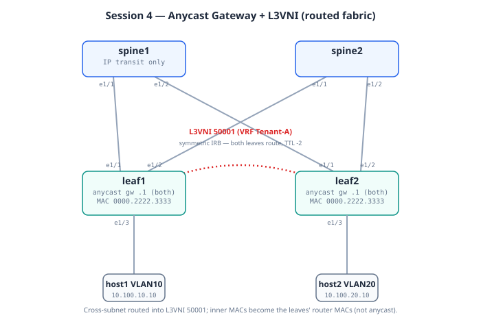

# Session 4: Anycast Gateway + Symmetric IRB

**Prerequisites**: Session 3 working. host1 can ping host2 over an
L2VNI. The fabric has BGP-EVPN distributing Type-2 and Type-3 routes.

**Goal**: Give every leaf an identical first-hop gateway IP for VLAN
10 (anycast), and add a second VLAN (VLAN 20) so we can route between
them across the fabric. By the end, you'll have hosts in different
subnets talking to each other through the fabric — and a packet
capture proving the routing happens on the local leaf before VXLAN
encap.

**Lab folder**: [`labs/04-anycast-gw`](../labs/04-anycast-gw/)

**Estimated time**: 60 minutes — this session has two new big ideas
(anycast + symmetric IRB), several configs, and a packet capture that
makes the concepts concrete.

---

## Bring-up

**Recommended (Model A chain)** — push onto the running lab:

```bash
cd ~/vxlan-evpn-zero-to-hero
./scripts/switch.sh 04-anycast-gw
# switch.sh prints the host-setup commands for this session:
# host1 stays in VLAN 10 (gw 10.100.10.1), host2 moves to VLAN 20
# (gw 10.100.20.1), both with 'ip route replace default'. Run those.
```

**Alternative (standalone)**: destroy + `./scripts/deploy.sh
04-anycast-gw`, then the same host setup.

## Topology (this session)




Same physical wiring. What's new: two subnets, an **anycast gateway on
every leaf** (same IP + MAC), VRF Tenant-A, and the **L3VNI** for
routed traffic:

```
   host1 VLAN 10                              host2 VLAN 20
   10.100.10.10/24                            10.100.20.10/24
   gw 10.100.10.1                             gw 10.100.20.1
     |                                              |
   leaf1                                          leaf2
   SVI Vlan10: 10.100.10.1  <- same anycast ->  SVI Vlan10: 10.100.10.1
   SVI Vlan20: 10.100.20.1     IPs + MAC        SVI Vlan20: 10.100.20.1
   (anycast MAC 0000.2222.3333 on both leaves, all SVIs)
     \\                                            //
      ================ L3VNI 50001 =================
        (VRF Tenant-A routed traffic, symmetric IRB:
         both leaves route; TTL drops by 2 end-to-end)
```

Cross-subnet traffic: routed at the ingress leaf into VNI **50001**,
carried across, routed again at egress. Same-subnet traffic still uses
the L2VNI (10010).

---

## Mental model

In Session 3, the fabric was one big virtual LAN. Hosts talked
host-to-host at Layer 2 over VXLAN. They had no gateway because they
didn't need one — same subnet, no routing.

Session 4 introduces the **fabric as a router**. Every leaf is willing
to be the gateway for VLAN 10. They all use the **same** IP
(10.100.10.1) and the **same** MAC. When host1 ARPs for its gateway,
its local leaf replies. When host1 moves to a different leaf, that
leaf replies — same IP, same MAC, host doesn't notice.

Picture it this way:
- **Without anycast**: every subnet has one router somewhere. To reach
  another subnet, your traffic must travel to that router, even if it's
  on the far side of the data center.
- **With anycast**: every leaf hosts every gateway. Routing happens at
  the first hop. Traffic takes the shortest path through the fabric.

> **The big shift**: this is when VXLAN-EVPN stops being "L2 stretch"
> and becomes "fully distributed routing fabric." You're not extending
> a VLAN anymore. You're letting tenant subnets exist everywhere
> simultaneously, with the fabric routing between them.

The second concept — **symmetric IRB** — answers: when traffic moves
between VLAN 10 and VLAN 20 across leaves, where does the routing
happen? Three choices:

1. **Centralized routing**: traffic from leaf1 goes to a central router,
   gets routed, comes back. The "go-to-the-data-center-edge-and-back"
   problem.
2. **Asymmetric IRB**: ingress leaf routes from L3 to L2, then
   encapsulates in the destination VLAN's L2VNI. Different VNIs for
   sending vs. return traffic.
3. **Symmetric IRB**: routing happens on the ingress leaf into a
   dedicated **L3VNI**, traverses the fabric in that L3VNI, and is
   routed again on egress. Same VNI both directions — symmetric.

Symmetric IRB is the modern standard. We'll use it because:
- It scales better (one L3VNI per VRF, regardless of how many VLANs)
- It makes troubleshooting symmetric (the path is the same both ways)
- It's required for inter-VRF routing in Session 5

This session lays the foundation: one VRF, two VLANs, one L3VNI. Same
VRF for both VLANs, so the routing is intra-VRF. Session 5 adds a
second VRF for proper inter-tenant isolation.

---

## What's an anycast gateway?

A regular gateway has one IP on one router. Hosts ARP for that IP, get
the router's MAC, send traffic.

An **anycast gateway** is the same IP on **multiple** routers
simultaneously. Cisco gives it a special common MAC (called the
"distributed gateway MAC" — usually `0000.2222.3333` or a vendor-defined
value). Every leaf with the same VLAN configured has the same gateway
IP and the same gateway MAC.

When host1 ARPs for its gateway:
1. host1 broadcasts ARP "who has 10.100.10.1?"
2. leaf1 (its local leaf) replies with the anycast MAC
3. host1 caches the MAC and sends all its inter-subnet traffic to it
4. leaf1 receives that traffic, routes it (it's a router for this VRF
   on this VLAN), encapsulates in the L3VNI, sends to the egress leaf

If host1 moves to leaf2 (e.g., vMotion in VMware), leaf2 now hosts the
same gateway with the same MAC. host1's ARP cache is still valid. The
host literally does not notice it moved.

> **Why one anycast MAC for everyone**: NX-OS uses a globally
> configurable distributed gateway MAC under `fabric forwarding`.
> Every leaf in the fabric uses this MAC for every anycast gateway.
> One MAC, used for every anycast IP, on every leaf. It's the same
> MAC across the entire fabric — and that's the point.

## The concepts that trip people up (read before the config)

Session 4 introduces four ideas that interlock. Getting them straight
here makes Sessions 5–11 much easier, because everything routed builds
on these.

### 1. Anycast gateway — same IP *and* same MAC on every leaf

Every leaf hosts the *identical* gateway IP **and** the identical
gateway MAC (`0000.2222.3333`) for a given subnet. A host's default
gateway is therefore always one hop away, on its *own* leaf — traffic
never trombones to a central router.

The line that does it: `fabric forwarding mode anycast-gateway` on the
SVI, plus a fabric-wide `fabric forwarding anycast-gateway-mac
0000.2222.3333`. The MAC must be identical on every leaf — that's the
one value that *cannot* drift (break-it covers what happens when it
does).

> **Why the same MAC matters:** if a host moves from leaf1 to leaf2
> (vMotion, etc.), its ARP cache still has `0000.2222.3333` for the
> gateway — and leaf2 answers to that exact MAC. No re-ARP, no gap. The
> shared MAC is what makes mobility seamless.

### 2. L2VNI vs L3VNI — two different jobs

You now have both kinds of VNI on the wire:

- **L2VNI** (10010, 10020): carries **bridged** frames between leaves
  for hosts in the *same* subnet. Inner MACs are the real host MACs.
- **L3VNI** (50001): carries **routed** packets between leaves for hosts
  in *different* subnets. One L3VNI per VRF. Inner MACs are the two
  leaves' **system Router MACs** (ingress leaf's → egress leaf's) —
  because the leaf routed, and routing rewrites L2 to next-hop addressing.

Same-subnet traffic → L2VNI. Cross-subnet traffic → L3VNI. The VNI in
the VXLAN header tells you which happened, which is why the capture is
worth doing: VNI 50001 in the header = "this was routed."

### 3. Symmetric IRB — why the TTL drops by exactly 2

IRB = Integrated Routing and Bridging (a leaf does both). The question
is *where* the routing happens on a cross-subnet flow:

- **Asymmetric IRB**: only the **ingress** leaf routes (into the
  destination L2VNI); the egress leaf just bridges. The two directions
  of a conversation take *different* VNIs — asymmetric. Needs every leaf
  to have every destination VLAN configured. Doesn't scale well.
- **Symmetric IRB** (what we use): **both** leaves route, through a
  shared **L3VNI**. Ingress leaf routes from the source VLAN into the
  L3VNI; egress leaf routes from the L3VNI into the destination VLAN.
  Both directions use the *same* L3VNI — symmetric. Each leaf only needs
  the VLANs of its *own* hosts.

The visible proof: **TTL decrements by 2** end-to-end (one per leaf that
routed). In your ping, `ttl=62` from a start of 64. The spine in the
middle does **not** decrement the inner packet — it only IP-routes the
outer VXLAN/UDP, so it doesn't touch the inner TTL. Two leaves route →
two decrements → 62.

### 4. Type-2 grows an IP, and Type-5 is born

Two route-table changes happen the moment you add the gateway:

- **Type-2 becomes MAC+IP.** In Session 3 the host's Type-2 was
  MAC-only (`[0.0.0.0]` in the IP field) because there was no SVI to
  learn its IP. Now the SVI exists, the leaf snoops the host's IP via
  ARP, and re-advertises the **same** host as a MAC+**IP** Type-2. That
  IP binding is what powers ARP suppression and host-route mobility.
- **Type-5 appears — IP Prefix routes.** A leaf advertises its
  *connected subnets* (10.100.10.0/24, 10.100.20.0/24) as **Type-5**
  routes so remote leaves know "to reach this subnet, send to my VTEP."
  Type-5 is how routing-by-prefix works across the fabric, and it only
  shows up once you have routed VRFs.

> **Type-2 vs Type-5, one line:** Type-2 = reach a specific **host**
> (MAC, or MAC+IP). Type-5 = reach a **subnet/prefix**. Both can carry
> "routed" info, but Type-2 is host-granular and Type-5 is
> prefix-granular.

### Why `redistribute direct` is required (the bug that bites everyone)

Adding `advertise l2vpn evpn` under the VRF is **not enough** to get
Type-5 routes. That command only *converts routes already in BGP's IPv4
table* into EVPN. By default BGP does **not** auto-pull the connected
SVI subnets — so the IPv4 table is empty, and Type-5 count stays at 0,
and cross-subnet ping fails.

The fix is **both** lines:

```
vrf Tenant-A
  address-family ipv4 unicast
    redistribute direct route-map ALL_ROUTES   ! pulls connected subnets INTO bgp
    advertise l2vpn evpn                         ! converts them to Type-5 EVPN
```

`redistribute direct` puts the connected subnets into BGP; `advertise
l2vpn evpn` then exports them as Type-5. Miss the first line and you get
a silent, confusing failure — this was a real first-deploy bug in this
lab, now documented so you don't repeat it.

### What `advertise-pip` is for

With anycast gateway, *every* leaf shares the gateway IP — so when a
leaf originates a Type-5 route, what next-hop does it use? If it used the
anycast VTEP IP, remote leaves couldn't tell *which physical leaf* to
send to. `advertise-pip` (Primary IP) tells the leaf to use its **own
unique** loopback1 VTEP IP as the Type-5 next-hop, not the shared
anycast IP — so prefix routes point at a specific leaf. Becomes
essential with vPC (Session 6), where two leaves share a VTEP VIP.

---

## Design decisions in this session

> The conceptual *why* for redistribute, advertise-pip, and ARP
> suppression is in **"The concepts that trip people up"** above. The
> decisions below focus on the **exact config** for each.


### Decision 1: VRF for tenant traffic

Up to now, host traffic lived in the default VRF (along with the
underlay). Session 4 introduces a tenant VRF — **Tenant-A**. This
separates:
- Underlay IP routing (default VRF)
- Tenant overlay routing (Tenant-A VRF)

The two VRFs share the same physical leaves but have completely
separate routing tables. host1's traffic to host2's gateway routes
within Tenant-A. The underlay BGP/OSPF traffic routes in default VRF.

This is a fundamental VXLAN-EVPN pattern: **VRFs separate tenants.**
Session 5 adds a second VRF (Tenant-B) and demonstrates true tenant
isolation.

### Decision 2: One L3VNI per VRF

Every VRF needs an L3VNI — the fabric-wide identifier used when
traffic is in the routed (L3) plane between leaves.

From `common/ipplan.md`:
- VRF Tenant-A maps to L3VNI 50001

Convention: L2VNIs are 10000+VLAN, L3VNIs are 50000+tenant-index.
This makes it visible at a glance: VNI 10010 = L2, VNI 50001 = L3.

Like L2VNIs, L3VNIs need an RD and RT. The L3VNI's RT controls which
leaves participate in this VRF's routing.

### Decision 3: SVI with `fabric forwarding mode anycast-gateway`

For each VLAN that needs L3, we create an SVI (`interface Vlan10`).
This SVI:
- Has the gateway IP (10.100.10.1)
- Lives inside the tenant VRF (`vrf member Tenant-A`)
- Has the magic line `fabric forwarding mode anycast-gateway` — this
  enables anycast behavior on the SVI

Without that one line, the SVI would be a regular SVI with regular ARP
behavior. With it, the SVI uses the fabric-wide anycast MAC and
suppresses ARP responses for IPs the EVPN control plane already knows
about.

### Decision 4: Redistribute connected subnets into BGP

This is the one that bit us during initial lab testing — worth its
own section.

For Type-5 EVPN routes (IP prefix advertisements) to flow between
leaves, the connected SVI subnets need to be in **BGP's IPv4 table
for the tenant VRF**. The line `advertise l2vpn evpn` under the VRF's
ipv4 unicast AF converts BGP IPv4 routes to EVPN Type-5 routes, but
**only routes BGP already knows about**.

By default, BGP doesn't automatically pull connected routes from the
RIB. You have to tell it explicitly:

```
route-map ALL_ROUTES permit 10
!
router bgp 65000
  vrf Tenant-A
    address-family ipv4 unicast
      redistribute direct route-map ALL_ROUTES
      advertise l2vpn evpn
```

The route-map with no match clauses matches everything (a "permit-all"
route-map). `redistribute direct` pulls connected routes into BGP, and
then `advertise l2vpn evpn` exports them as Type-5.

Without this, the fabric will look correct (BGP sessions up, L3VNI
defined, anycast gateways alive) but **cross-subnet ping fails
silently** because no leaf advertises a path to the remote subnet.

### Decision 5: The `advertise-pip` knob

When a leaf advertises a Type-5 route, it needs to say "the next-hop
for this prefix is me." With anycast gateway, **every leaf** could
equally be the next-hop. The fabric uses each leaf's **PIP** (Primary
IP — its loopback1) as the next-hop, not the anycast IP.

`advertise-pip` under BGP EVPN tells the leaf to put its own PIP as
next-hop on EVPN Type-5 advertisements. Without it, Type-5 routes
might point at the anycast IP, which isn't unique across the fabric.

### Decision 6: ARP suppression

Anycast gateways enable **ARP suppression**. When a leaf knows (via
EVPN Type-2 routes) the MAC for an IP, and a host ARPs for that IP,
the leaf replies locally instead of flooding the ARP to the fabric.

This is enormous for scale. Without it, every ARP gets flooded to
every leaf in the fabric. With it, ARPs stay local most of the time.

ARP suppression is automatically enabled when you enable anycast
gateway. You just see fewer ARP broadcasts in the wild.

## What you'll build

**Same fabric, additional config on leaves**:

1. Configure the distributed gateway MAC
2. Create a "permit all" route-map for redistribution
3. Create VRF Tenant-A, with an associated L3VNI 50001
4. Map VLAN 20 to L2VNI 10020 (a second VLAN this session)
5. Create SVIs for VLAN 10 and VLAN 20 (both anycast)
6. Create the L3VNI carrier SVI (Vlan99 in the VRF)
7. Add NVE members for VNI 10020 (L2) and VNI 50001 (L3)
8. Configure BGP EVPN with `advertise-pip` plus the VRF redistribution

**Hosts**:
- host1 stays on VLAN 10, gets gateway `10.100.10.1`
- host2 moves to VLAN 20, gets gateway `10.100.20.1`

## Deploying (standalone alternative)

> The recommended path is the `switch.sh` chain — see **Bring-up** at
> the top of this doc. The steps below are the standalone alternative:
> a fresh deploy of this session's own topology.

```bash
containerlab destroy -t labs/03-l2vni/topology.clab.yml --cleanup
./scripts/deploy.sh 04-anycast-gw
```

Usual 15-25 min boot.

## Configuring the hosts

The hosts in this lab have **two** network interfaces: `eth0` is
clab's management bridge (with a default route pointing at clab's
gateway), and `eth1` is the lab interface connected to the leaf.

To make the host send tenant traffic via the leaf, we have to
**replace** the default route, not just add one. Using `ip route add`
silently fails because a default already exists via eth0.

```bash
# host1: VLAN 10, gateway 10.100.10.1
docker exec clab-vxlan-evpn-host1 sh -c "ip addr add 10.100.10.10/24 dev eth1 && ip link set eth1 up && ip route replace default via 10.100.10.1"

# host2: VLAN 20, gateway 10.100.20.1
docker exec clab-vxlan-evpn-host2 sh -c "ip addr add 10.100.20.10/24 dev eth1 && ip link set eth1 up && ip route replace default via 10.100.20.1"
```

The `ip route replace` form overwrites any existing default. Verify
with:

```bash
docker exec clab-vxlan-evpn-host1 ip route
```

You should see `default via 10.100.10.1 dev eth1` — not via eth0.

> **Note**: After this change, hosts lose internet access via clab's
> management bridge. That's fine for our lab — we don't need internet
> from inside a tenant subnet. `docker exec` still works because it
> bypasses host routing.

## The moment of truth (with packet capture)

This session has **two** moments of truth.

**First moment**: host1 (VLAN 10) pings its own gateway. Proves anycast
works:

```bash
docker exec clab-vxlan-evpn-host1 ping -c 3 10.100.10.1
```

Should succeed instantly. The reply comes from leaf1 (local leaf) with
anycast MAC `00:00:22:22:33:33`.

**Second moment**: host1 pings host2. Crossing subnets, crossing leaves.

> **Capture gotcha — pick the right uplink (this will bite you).** leaf1
> has **two** uplinks: `eth1` to spine1 and `eth2` to spine2. The
> underlay is ECMP, so a given VXLAN flow hashes to **one** of them and
> stays there. If you capture on `eth1` but the flow hashed to spine2,
> your pcap will be **empty of VXLAN** even though the ping works
> perfectly — you'll only see OSPF/BGP control traffic on that link.
> This is *not* a timing or Ctrl-C problem; the traffic is simply on the
> other wire. The fix: capture on the uplink the flow actually uses, or
> capture both `eth1` and `eth2` at once (two terminals) — one will have
> it.

**Correct sequence (two terminals).** The capture must be running and
waiting *before* the ping starts:

```bash
# Terminal 1 - start the capture, then LEAVE IT (do not Ctrl-C yet).
# Try eth2 first; if it comes up empty, repeat with eth1.
./scripts/capture.sh leaf1 eth2 04-anycast-cross-subnet 'udp port 4789'
```

```bash
# Terminal 2 - now that the capture is waiting, fire the ping:
docker exec clab-vxlan-evpn-host1 ping -c 5 10.100.20.10
```

Then return to Terminal 1 and Ctrl-C the capture (5 pings = 10 packets,
below the 50-packet auto-stop). Confirm it caught VXLAN before opening
Wireshark:

```bash
tcpdump -r ~/vxlan-evpn-zero-to-hero/pcaps/04-anycast-cross-subnet-*.pcap -nn | head
# want lines like: 10.0.1.21.xxxxx > 10.0.1.22.4789   (VTEP-to-VTEP, VXLAN)
```

> If `tcpdump` is "not found" on the VM host, `sudo apt install -y
> tcpdump` once. The capture itself runs inside the node and works
> regardless of whether the host has tcpdump.

If everything works:
- The first packet may be lost (ARP resolution); subsequent ones succeed
- TTL of the replies is 62 (started at 64, decremented by 2 — one
  decrement per leaf doing L3 routing). **TTL 62 is your symmetric-IRB
  proof.**
- The capture has VXLAN frames with **VNI 50001** (the L3VNI), not 10010
  or 10020
- Inside the VXLAN, the **inner source/dest MACs are the two leaves'
  system Router MACs** (leaf1's router MAC → leaf2's router MAC), **not**
  the host MACs and **not** the anycast gateway MAC. The original host
  MACs are gone — that rewrite is the visual proof the leaf *routed* the
  packet (routers rewrite L2 headers; bridges don't). Each leaf's router
  MAC is carried in BGP as the Router-MAC extended community, which is
  how the ingress leaf knows the egress leaf's router MAC to stamp.

> **Common misconception:** the inner MAC on the L3VNI is the *egress
> leaf's router MAC*, not the anycast gateway MAC `0000.2222.3333`. The
> anycast MAC is what the **host** sees as its gateway (host↔leaf); once
> the leaf routes onto the L3VNI, the inner frame is addressed
> leaf-router-MAC → leaf-router-MAC. Look for two *different* MACs in the
> capture (one per leaf), not a doubled anycast MAC.

## What to verify

See [`labs/04-anycast-gw/verify.md`](../labs/04-anycast-gw/verify.md).

## What to break

See [`labs/04-anycast-gw/break-it.md`](../labs/04-anycast-gw/break-it.md).

## Control-plane verification — the Router-MAC in the wild

The symmetric-IRB inner MACs (this doc's big correction) are carried in
BGP. See them:
```bash
ssh admin@clab-vxlan-evpn-leaf1 'show bgp l2vpn evpn 10.100.20.10' | grep -i "router\|rt:\|encap"
```
Look for the **`Router MAC:`** extended community on leaf2's Type-2 —
that exact MAC is what leaf1 stamps as inner destination on the L3VNI.
Cross-check against `show nve interface nve1 detail | include Router`
on leaf2: they must match. That's the control-plane→data-plane chain,
verified in one pair of commands.

> ⚠ Some references claim the router MAC also appears as a standalone
> MAC-only Type-2 tagged with the L3VNI. On NX-OS it primarily rides as
> the extended community; check your table before teaching the other
> form: `show bgp l2vpn evpn | include 0.0.0.0`.

---

## Day in the life of a packet — host1 pings host2 (cross-subnet, symmetric IRB)

`10.100.10.10 (VLAN10, leaf1) → 10.100.20.10 (VLAN20, leaf2)`. Bridge–route–route–bridge; TTL arrives **62**.

**Hop 0 — host1: gateway decision.** WHAT: dst is off-subnet → host1 sends to its default gateway; ARPs for 10.100.10.1 and gets the **anycast MAC** (every leaf answers the same). WHY anycast: the host's gateway is wherever the host is — VM moves need no re-ARP. VERIFY: `docker exec host1 ip neigh` (gateway MAC = the configured anycast MAC on all leaves).

**Hop 1 — leaf1: the bridge→route pivot.** WHAT: frame's dst MAC = leaf1's own gateway MAC → ASIC stops bridging, strips L2, does an L3 lookup in **VRF Tenant-A**: 10.100.20.10/32 known via Type-2, next-hop VTEP 10.0.1.22 over **L3VNI 50001**. TTL 64→63. Rewrite: inner src MAC = **leaf1's router MAC**, inner dst MAC = **leaf2's router MAC** (learned from the Router-MAC ext-community — NOT the anycast MAC). Encap VNI 50001. WHY L3VNI not the destination L2VNI: leaf1 may not even have VLAN 20 — that's the whole point of symmetric IRB. VERIFY: `show ip route 10.100.20.10 vrf Tenant-A` (segid 50001, encap VXLAN), `show bgp l2vpn evpn 10.100.20.10 | grep -i router` (the router MAC it will stamp).

**Hop 2 — spine: outer transit** (as always — invisible to the story).

**Hop 3 — leaf2: route again.** WHAT: decap; **VNI 50001 selects VRF Tenant-A** (the VNI *is* the VRF context on the wire); inner dst MAC = its own router MAC → route: 10.100.20.10 is directly connected on Vlan20. TTL 63→62. WHY the second routing: leaf1 couldn't L2-address a VLAN it doesn't have; leaf2 finishes the job locally. VERIFY: `show nve interface nve1 detail | include Router` on leaf2 = the MAC seen in hop 1's BGP output.

**Hop 4 — leaf2: route→bridge pivot.** WHAT: ARP/adjacency for host2's real MAC, rewrite L2 for VLAN 20, deliver. VERIFY end to end: host2 sees TTL 62 and — in a two-uplink capture — inner MACs are two **different** router MACs, host MACs gone. WHEN people get this wrong: expecting the anycast MAC inside the tunnel (this doc's own original error — corrected against the live capture).

---

## Quick review (flashcards)

Cover the right column. Builds on Session 3's set with the routing
concepts.

### Anycast gateway and IRB

| Question | Answer |
|----------|--------|
| What is an anycast gateway? | The **same gateway IP *and* MAC on every leaf** for a subnet, so a host's gateway is always on its own leaf — no tromboning to a central router. |
| Which two things must match across all leaves? | The anycast **IP** (per subnet) and the anycast **MAC** (`0000.2222.3333`, fabric-wide). The MAC must never drift. |
| Why does the shared anycast MAC enable host mobility? | A moved host's ARP cache still has `0000.2222.3333`; the new leaf answers to that exact MAC — no re-ARP, no gap. |
| L2VNI vs L3VNI? | **L2VNI** bridges same-subnet frames (inner MACs = real host MACs). **L3VNI** carries routed cross-subnet packets (inner MACs = the two leaves' **system Router MACs**, not the anycast MAC). One L3VNI per VRF. |
| What is symmetric IRB? | **Both** leaves route, via a shared **L3VNI** — ingress routes source-VLAN→L3VNI, egress routes L3VNI→dest-VLAN. Same VNI both directions. |
| Asymmetric vs symmetric IRB? | Asymmetric: only ingress leaf routes, needs every dest VLAN everywhere, doesn't scale. Symmetric: both leaves route via L3VNI, each leaf only needs its own VLANs. |
| Why does cross-subnet TTL drop by exactly 2? | Two leaves route the packet (one decrement each). The spine only IP-routes the outer VXLAN/UDP and never touches the inner TTL. Start 64 → 62. |
| What does TTL=62 prove? | **Symmetric IRB is working** — both leaves performed L3 routing. |

### Routes and advertisement

| Question | Answer |
|----------|--------|
| How does Type-2 change when you add the gateway? | It goes from **MAC-only** (Session 3) to **MAC+IP** — the SVI lets the leaf snoop the host IP and advertise the IP→MAC binding. |
| What is a Type-5 route? | An **IP Prefix route** — advertises a connected subnet so remote leaves know which VTEP to send to for that prefix. Appears only with routed VRFs. |
| Type-2 vs Type-5? | Type-2 = reach a specific **host** (MAC or MAC+IP). Type-5 = reach a **subnet/prefix**. |
| Why is `advertise l2vpn evpn` alone not enough for Type-5? | It only converts routes *already in BGP's IPv4 table*. By default connected SVI subnets aren't there, so Type-5 stays at 0. |
| What fixes that? | Add `redistribute direct route-map ALL_ROUTES` — it pulls connected subnets **into** BGP; then `advertise l2vpn evpn` exports them as Type-5. Both lines required. |
| What does `advertise-pip` do? | Makes a leaf use its **own unique loopback1 VTEP IP** (Primary IP) as the Type-5 next-hop instead of the shared anycast IP, so prefix routes point at a specific physical leaf. Essential with vPC. |

| What is the bridge-route-route-bridge sequence? | The symmetric IRB packet walk: ingress leaf **bridges** (sees own gw MAC) then **routes** onto the L3VNI; egress leaf **routes** off the L3VNI then **bridges** to the local VLAN. |
| How does the ASIC decide to bridge or route an incoming frame? | By the **inner destination MAC**. Host MAC → bridge (L2VNI). The switch's own gateway/router MAC → route (L3VNI). |
| Why does one host's Type-2 appear twice on a remote leaf? | One advertisement, two installs: a **bridging copy** in the L2VNI table and a **routing copy** in the L3VNI/VRF table. Not a bug. |
| What carries the egress leaf's router MAC to the ingress leaf? | The BGP **Router-MAC extended community** attached to the Type-2/Type-5 route. |

### Config lines and verification

| Question | Answer |
|----------|--------|
| Which line makes an SVI an anycast gateway? | `fabric forwarding mode anycast-gateway` on the SVI (plus the fabric-wide `fabric forwarding anycast-gateway-mac`). |
| In a cross-subnet capture, which VNI appears? | The **L3VNI 50001**, not the L2VNIs (10010/10020). |
| In that capture, what are the inner source/dest MACs? | The **two leaves' system Router MACs** (ingress leaf's → egress leaf's), learned via the BGP **Router-MAC extended community**. NOT the anycast MAC — that's only the host-facing gateway MAC. Two *different* MACs, one per leaf. |
| Capture shows ping works but pcap is empty of VXLAN — why? | ECMP hashed the flow to the **other uplink**. Capture the uplink the flow uses, or capture both `eth1` and `eth2`. |
| How do you see Type-5 routes on a leaf? | `show bgp l2vpn evpn route-type 5` — expect one per connected subnet, originated locally and learned from the remote leaf. |

> ARP suppression (from Session 3's cards) becomes fully real here —
> it's the MAC+IP Type-2 routes created in this session that let a leaf
> answer ARP locally.

---

## What you should be able to explain

1. What's an anycast gateway and what problem does it solve?
2. What is the "distributed gateway MAC" and why is it the same on
   every leaf?
3. What's the difference between an L2VNI and an L3VNI?
4. Walk me through the path of a packet from host1 (VLAN 10) to host2
   (VLAN 20) including encap/decap stages.
5. Why is symmetric IRB called "symmetric"?
6. What's the role of `redistribute direct` and why is it needed even
   when `advertise l2vpn evpn` is already there?
7. What does `advertise-pip` do?
8. How does a host's Type-2 route change between Session 3 and Session 4,
   and how do you spot it in `show` output?
9. In a cross-subnet capture, which VNI appears and what are the inner
   MACs — and why does that prove the leaf routed?
10. If your ping works but the pcap has no VXLAN, what's the most likely
    cause and the fix?

## Lessons from initial lab testing

When this session was first deployed end-to-end, two real issues
surfaced that the original configs missed. Both are now baked into
the cfg files and docs, but worth knowing about because they're
recurring real-world bugs:

1. **`advertise l2vpn evpn` alone is not enough**. You need
   `redistribute direct route-map ALL_ROUTES` (plus the route-map
   itself) for connected subnets to make it into EVPN as Type-5
   routes. Without it, the fabric looks right but pings fail.

2. **Hosts attached via containerlab have a default route via the
   management bridge**. `ip route add default` silently fails. Use
   `ip route replace default`.

## The packet walk (bridge–route–route–bridge)

Cisco NX-OS implements **symmetric IRB**, and the canonical way to
describe a cross-subnet flow is **bridge–route–route–bridge**. Trace
host1 (VLAN 10, leaf1) → host2 (VLAN 20, leaf2):

1. **Bridge (leaf1):** host1's frame arrives with destination MAC = the
   anycast gateway MAC. leaf1's ASIC does an L2 lookup, sees the
   destination MAC is *its own gateway MAC*, and concludes "this is for
   me to route."
2. **Route (leaf1):** leaf1 does an L3 lookup in VRF Tenant-A for host2's
   IP. The route points across the fabric via the **L3VNI 50001**. leaf1
   rewrites the inner Ethernet header — source = **leaf1's router MAC**,
   destination = **leaf2's router MAC** — VXLAN-encapsulates with VNI
   50001, and sends it to leaf2's VTEP.
3. **Route (leaf2):** leaf2 decapsulates, sees VNI 50001 → maps to VRF
   Tenant-A, sees the inner destination MAC is *its own* router MAC →
   does an L3 lookup for host2's IP. The route says "directly connected,
   VLAN 20."
4. **Bridge (leaf2):** leaf2 ARPs (or has cached) host2's real MAC,
   rewrites the frame for the local VLAN 20 segment, and delivers it.

Two routing operations (steps 2 and 3) = the two TTL decrements you saw
(64 → 62). The **VNI in the header carrying the VRF context** is what
lets leaf2 know which routing table to use — that's the whole point of
the L3VNI.

> **How the ASIC decides bridge vs route:** it's the **inner destination
> MAC**. If it's a host's MAC → bridge (L2VNI). If it's the switch's own
> gateway/router MAC → route (L3VNI). One field decides everything.

---

## One Type-2 route, two operational copies

When leaf2 advertises host2 as a MAC+IP Type-2 route, leaf1 installs it
in **two** different tables:

- A **bridging copy** in the L2VNI (VLAN) table — used if a local host
  in the *same* subnet as host2 wants to reach it at L2.
- A **routing copy** in the L3VNI (VRF) table — used when a local host
  in a *different* subnet needs to route to host2 over the L3VNI.

So the same host showing up "twice" in your `show` output isn't a bug —
it's one advertisement sliced into the two forwarding roles symmetric
IRB needs. (Credit: this framing came from a parallel deep-dive; it
matches how NX-OS installs the routes.)

---

## Next

You've now got a routed, single-tenant fabric. Session 5 adds a **second
tenant** and shows the isolation boundary — then deliberately punches a
hole through it.

**To advance (Model A — no redeploy, push onto the running lab):**

```bash
./scripts/switch.sh 05a-tenant-b
```

Then run the host-setup commands it prints — **host2 moves** to
Tenant-B's `10.200.10.0/24`. The first test is an *isolation* test:

```bash
docker exec clab-vxlan-evpn-host1 ping -c 3 10.200.10.10   # SHOULD FAIL
```

That failure is the lesson — two VRFs can't reach each other by default,
even on the same fabric. Then:

```bash
./scripts/switch.sh 05b-route-leak
```

No host changes. The *same* ping now **succeeds** — because 5b imports
the other VRF's Route Target to leak the route. (Remember from Session
3's RD/RT cards: RT is the import-policy knob. Session 5b is where you
use it on purpose.)

> **Preview of a Session 5 design trap:** you leak between tenants at
> **Layer 3** (manipulating VRF Route Targets) — a safe, routed hole.
> You do **not** merge tenants by giving two L2VNIs the same RT: that
> fuses their broadcast domains and a storm in one wipes out the other.
> L3 route-leak = surgical; L2 RT-merge = maximum blast radius.

**What Session 5 introduces:** a second L3VNI (50002 for Tenant-B), the
per-VRF RT import/export that controls routing isolation, and the
difference between L2VNI RTs (which VLAN's MAC table) and VRF RTs (which
VRF's IP routing table).
