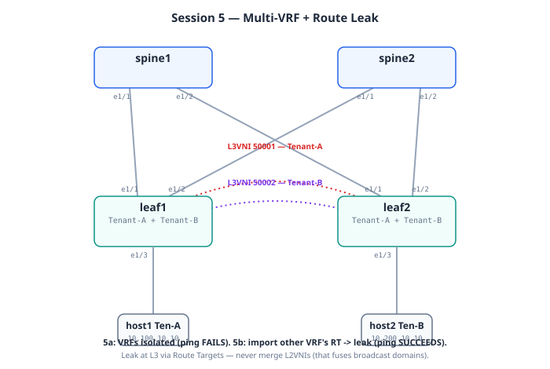

# Session 5: Multi-VRF + Route Leaking

**Prerequisites**: Session 4 working. Cross-subnet ping in Tenant-A
working with anycast gateway and L3VNI 50001.

**Goal**: Add a second tenant (Tenant-B) and demonstrate three
things in order:

1. Tenants in different VRFs are **isolated by default** — host1 in
   Tenant-A cannot reach a host in Tenant-B even if their IP
   addressing overlaps
2. **Route leaking** breaks isolation deliberately — when business
   requires, we can configure VRFs to exchange selected prefixes
3. The BGP EVPN control plane shows the leak explicitly via
   import/export route-targets

**Lab folders**: `labs/05a-tenant-b/` and `labs/05b-route-leak/`

**Estimated time**: 45 minutes total (~15 min for 5a, ~25 min for
5b plus verification).

---

## Bring-up

Two sub-sessions, applied in order on the running lab (Model A):

```bash
cd ~/vxlan-evpn-zero-to-hero

# 5a — add Tenant-B, prove isolation
./scripts/switch.sh 05a-tenant-b
# switch.sh prints the host setup: host2 MOVES to Tenant-B's
# 10.200.10.0/24. Run those commands, then the isolation test
# (host1 -> host2 ping SHOULD FAIL).

# 5b — route leak (after 5a verified)
./scripts/switch.sh 05b-route-leak
# No host changes. The same ping now SUCCEEDS.
```

**Alternative (standalone)**: each sub-session's lab folder is also
independently deployable with `deploy.sh`, but the chain above is the
intended teaching flow.

## Topology (this session)



*(Rendered diagram above; the ASCII version below is the text fallback.)*


Same physical wiring. What's new: a second VRF with its own L3VNI —
two parallel routing planes on the same fabric:

```
   host1                                          host2 (MOVED)
   Tenant-A VLAN 10                               Tenant-B VLAN 30
   10.100.10.10/24                                10.200.10.10/24
     |                                                  |
   leaf1                                              leaf2

   Tenant-A: VLANs 10,20  -> L2VNIs 10010,10020 -> L3VNI 50001
   Tenant-B: VLANs 30,40  -> L2VNIs 10030,10040 -> L3VNI 50002

      Tenant-A plane  ========= L3VNI 50001 =========
      Tenant-B plane  ========= L3VNI 50002 =========
                      (isolated until 5b's route leak:
                       RT 65000:50001 <-> 65000:50002 import)
```

5a proves the planes don't touch (ping FAILS). 5b builds the explicit
on-ramp via route-target import (same ping SUCCEEDS, TTL still 62).

---

## Mental model

Sessions 1-4 built a fabric with **one tenant**: Tenant-A. Everything
in 10.100.0.0/16, all on the same routing plane. That works for a
single customer — but real data centers host multiple isolated
networks (tenants, environments, security zones).

The mental model for Session 5:

> A **VRF** is a routing namespace. Two VRFs on the same physical
> switch are completely separate — they could even use the same IP
> subnet without conflict. By default, traffic in VRF A cannot
> reach VRF B, no matter what.
>
> **Route leaking** is the explicit, controlled exception. You tell
> VRF A: "import these specific routes from VRF B." Now selected
> traffic can cross between the two — but only what you've allowed.

Picture it as **two parallel highway systems**: Tenant-A on one,
Tenant-B on another. By default they don't touch. Route leaking
builds **specific on-ramps** between the two — controlled, surveyed,
monitored. You decide which traffic gets to cross.

---

## Part 1: Session 5a — Add Tenant-B (and prove isolation)

### What we're adding

- A second VRF: **Tenant-B** with L3VNI **50002**
- Two new L2VLANs: VLAN 30 → VNI 10030, VLAN 40 → VNI 10040
- New tenant subnets: 10.200.10.0/24 (VLAN 30) and 10.200.20.0/24
  (VLAN 40)
- Anycast SVIs for both VLANs on both leaves
- **host2 moves to Tenant-B's VLAN 30** (was VLAN 20 in Tenant-A)

After this:
- host1 lives in Tenant-A, subnet 10.100.10.0/24, gateway 10.100.10.1
- host2 lives in Tenant-B, subnet 10.200.10.0/24, gateway 10.200.10.1
- They share the same physical fabric but cannot reach each other

### Design decisions in 5a

**Decision 1: L3VNI per VRF**

Each VRF needs its own L3VNI. Tenant-A keeps VNI 50001. Tenant-B
gets VNI 50002. The L3VNI is what carries routed traffic across
the fabric within that VRF. Cross-VNI traffic doesn't happen
naturally — that's the isolation mechanism.

**Decision 2: Same VLAN numbering pattern**

VLAN 30/40 → VNI 10030/10040. Same convention as Sessions 3-4
(L2VNI = 10000 + VLAN). Makes Tenant-B's VNIs visually distinct
from Tenant-A's (10010, 10020) and from L3VNIs (50001, 50002).

**Decision 3: Different subnet ranges for visual clarity**

Tenant-A uses 10.100.x.x, Tenant-B uses 10.200.x.x. Not strictly
required — VRF isolation means they *could* both use 10.0.0.0/8
without conflict. Different prefixes just make show output easier
to read while teaching.

### What you'll do

Deploy 5a:

```bash
./scripts/switch.sh 05a-tenant-b
```

Then re-configure hosts (host2 changes subnets):

```bash
docker exec clab-vxlan-evpn-host1 sh -c "ip addr flush dev eth1; ip addr add 10.100.10.10/24 dev eth1; ip link set eth1 up; ip route replace default via 10.100.10.1"

docker exec clab-vxlan-evpn-host2 sh -c "ip addr flush dev eth1; ip addr add 10.200.10.10/24 dev eth1; ip link set eth1 up; ip route replace default via 10.200.10.1"
```

Notice: host2 is now in `10.200.10.0/24` (Tenant-B), not
`10.100.20.0/24` (Tenant-A as it was in Session 4).

### The two key tests for 5a

**Test 1: Each host can reach its own gateway**

```bash
docker exec clab-vxlan-evpn-host1 ping -c 3 10.100.10.1
docker exec clab-vxlan-evpn-host2 ping -c 3 10.200.10.1
```

Both should succeed. host1 talks to its leaf as gateway in
Tenant-A. host2 talks to its leaf as gateway in Tenant-B.

**Test 2: Isolation — host1 CANNOT reach host2**

```bash
docker exec clab-vxlan-evpn-host1 ping -c 3 10.200.10.10
```

**This should fail.** 100% packet loss. host2 lives in a different
VRF, and Tenant-A has no route to Tenant-B's address space.

If this ping succeeds, isolation is broken — something is wrong
with the VRF separation. We'll diagnose if that happens.

The isolation failure is the **proof that the VRFs are real**. If
you see "Destination Net Unreachable" or just timeouts, that's
correct.

### What to verify (5a)

See `labs/05a-tenant-b/verify.md`. Quick highlights:

- `show vrf` lists both Tenant-A and Tenant-B
- `show nve vni` shows L3VNI 50002 is up
- BGP EVPN Type-5 routes exist for **both** VRF's subnets, but each
  carries different RTs
- `show ip route vrf Tenant-A` has no entry for 10.200.x.x
- `show ip route vrf Tenant-B` has no entry for 10.100.x.x

That last pair is the structural proof of isolation. Each VRF
literally doesn't know about the other's routes.

---

## Part 2: Session 5b — Route Leaking

### The problem we're solving

Sometimes tenants need to talk. Two real examples:

- A "shared services" pattern: DNS, NTP, AAA servers in their own
  VRF, all tenants need to reach them
- A merger between business units: Tenant-A is engineering, Tenant-B
  is acquired-company. They now need partial reachability

VRF isolation by default is the **right** starting point. Route
leaking is the **explicit exception**, configured per route per
direction.

### How route leaking works in VXLAN-EVPN

Each VRF has a **Route Target (RT)** on its L3VNI. By default:

- Tenant-A's L3VNI 50001 advertises with RT `65000:50001`
  and imports only RT `65000:50001`
- Tenant-B's L3VNI 50002 advertises with RT `65000:50002`
  and imports only RT `65000:50002`

So Tenant-A only learns routes tagged with its own RT — its own
prefixes — and ignores everything else.

To leak Tenant-B's routes into Tenant-A:

```
vrf context Tenant-A
  address-family ipv4 unicast
    route-target import 65000:50002 evpn
```

This says "Tenant-A: also import EVPN routes tagged with
65000:50002 (which is Tenant-B's RT)." Now Tenant-A's route table
includes Tenant-B's prefixes.

For symmetric leaking (which we'll do), we also do the reverse on
Tenant-B.

### Design decisions in 5b

**Decision 1: Symmetric leak for teaching simplicity**

We import both directions: Tenant-A imports Tenant-B's RT, and
Tenant-B imports Tenant-A's RT. In production you'd usually do
one-way leaks (shared-services pattern) — but symmetric is easier
to demonstrate.

**Decision 2: Leak ALL routes, not selective**

We use the simple `route-target import` form, which leaks all
routes carrying that RT. Selective leaking via route-maps is
possible but more configuration noise. We'll mention it as
"what to do in production" without configuring it here.

**Decision 3: Configure leak on both leaves**

Even though leaf1 has host1 (Tenant-A) and leaf2 has host2
(Tenant-B), we configure the import on **both leaves** identically.
Why? Because the anycast model — every leaf can host every VRF.
If host1 ever moved to leaf2, leaf2 needs to know how to leak
routes for it. Configuration symmetry across leaves is the
discipline.

### What you'll do (5b)

```bash
./scripts/switch.sh 05b-route-leak
```

No host reconfiguration needed — hosts are still at their 5a
addresses.

### The key test for 5b

```bash
docker exec clab-vxlan-evpn-host1 ping -c 3 10.200.10.10
```

**This should now succeed.** Same ping that failed in 5a, now
works because route leaking made Tenant-B's subnet visible to
Tenant-A.

If you watch the TTL, it should still be 62 — same as Session 4.
The packet still traverses two L3 hops (one routing at each leaf).
The only difference is that the routes between the two leaves
crossed VRF boundaries via the EVPN import.

### What to verify (5b)

See `labs/05b-route-leak/verify.md`. Highlights:

- `show ip route vrf Tenant-A` now shows 10.200.x.x prefixes
- `show ip route vrf Tenant-B` now shows 10.100.x.x prefixes
- `show bgp l2vpn evpn route-type 5` shows the routes are being
  imported (look for `Imported to: Tenant-A` annotations)
- Capture: VXLAN packets between leaves still use **the local VRF's
  L3VNI** for encapsulation. Route leaking changes the **routing
  plane**, not the **data plane**. The encap happens in the
  originating VRF's L3VNI.

That last point is worth pausing on. Route leaking is purely a
control-plane operation — it changes which routes a VRF knows
about, but encapsulation still happens per-VRF. From a traffic
flow perspective the packet still rides the originating VRF's
L3VNI.

### What this looks like in a capture

For the cross-tenant ping after route leaking:

| Outer | Value |
|-------|-------|
| Outer IP src | 10.0.1.21 (leaf1 VTEP) |
| Outer IP dst | 10.0.1.22 (leaf2 VTEP) |
| Outer UDP dst | 4789 (VXLAN) |
| VXLAN VNI | **50001** (Tenant-A's L3VNI — because the packet originated in Tenant-A) |

| Inner | Value |
|-------|-------|
| Inner src IP | 10.100.10.10 (host1, in Tenant-A) |
| Inner dst IP | 10.200.10.10 (host2, in Tenant-B) |
| Inner src MAC | anycast gateway MAC (leaf1 routed) |
| Inner dst MAC | anycast gateway MAC (heading to leaf2 to route) |

The reply travels in the opposite direction, using **Tenant-B's**
L3VNI 50002. So a bidirectional ping uses BOTH L3VNIs — one per
direction. That's a nuance most VXLAN guides skip.

---

## What you should be able to explain after Session 5

1. What is a VRF and why does VXLAN-EVPN use them?
2. Why are VRFs isolated by default?
3. How does an EVPN Type-5 route get tagged with its origin VRF?
   (Answer: the L3VNI's RT — extended community.)
4. What does `route-target import` do that's different from
   `route-target import ... evpn`?
5. When traffic crosses VRFs via a leak, which VNI carries the
   packet — the origin VRF's L3VNI or the destination's?
6. What's the difference between "symmetric leaking" and "one-way
   leaking" and which is more common in production?

---

## Common production patterns we're foreshadowing

- **Shared services VRF**: Sessions 5b's symmetric leak isn't
  what production does. Real shared services use a "leak from
  shared into each tenant" pattern — one-way, asymmetric.
  Tenant-A imports Shared's RT, Shared does NOT import Tenant-A's
  RT.
- **External / Internet VRF**: Same pattern, but Shared = "the
  internet edge VRF" with default route. Tenants import it for
  outbound connectivity.
- **VRF-lite vs VRF on a fabric**: VRF-lite (single-device VRF
  separation) and VXLAN-EVPN VRFs are conceptually the same but
  the EVPN form scales across hundreds of leaves automatically.

These will come up in Session 9 (L3Out) and Session 10
(Multi-Pod) as real configuration.

---

## Next

**Session 6: vPC**. Dual-home host1 to both leaf1 AND leaf2, so
the host has two physical paths and survives a leaf failure. This
is the most production-relevant skill in the curriculum but also
the most config-dense session.
