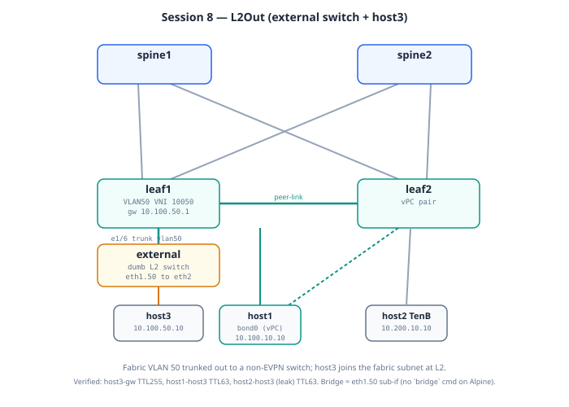

# Session 8: L2Out — Extending L2VNI to External Switches

**Prerequisites**: Session 6c working (vPC + shared VTEP). Topology
change required — adds external switch and host3.

**Goal**: Extend an L2VNI (VLAN 50) out to a non-EVPN switch. The
external switch participates in VLAN 50's broadcast domain but
doesn't speak BGP-EVPN. Hosts behind the external switch appear
in the EVPN fabric as if they were directly attached.

**Lab folder**: `labs/08-l2out/`

**Estimated time**: 25-30 minutes

**Why this matters**: Real data centers always have a mix of
fabric-attached and legacy gear. L2Out is how the fabric integrates
with that legacy gear without forcing it to speak modern protocols.
A bank with VMware ESXi clusters on top-of-rack switches that
don't run EVPN still needs those VMs in the same VLAN as fabric-
attached workloads. L2Out solves this.

---

## Bring-up

**Self-contained session (Model B)** — this topology adds the
`external` switch and `host3` containers, so it deploys fresh rather
than layering on the running lab. See
[`DEPLOYMENT.md`](DEPLOYMENT.md).

```bash
cd ~/vxlan-evpn-zero-to-hero

# 1. Tear down whatever is running (frees RAM, avoids node-name clashes).
#    Point destroy at the topology that is CURRENTLY deployed:
containerlab destroy -t labs/<current-session>/topology.clab.yml --cleanup

# 2. Deploy this session's self-contained topology (~15 min)
./scripts/deploy.sh 08-l2out

# 3. Wait for all n9kv (healthy), then push configs
watch -n 10 'docker ps --format "{{.Names}}\t{{.Status}}" | grep clab-vxlan'
./scripts/switch.sh 08-l2out

# 4. Configure the hosts + external switch — see "Host and external
#    setup" below. NOTE the two gotchas there: host1 needs an LACP BOND
#    (it inherits the vPC from Session 6), and the external bridge must
#    use a VLAN sub-interface (Alpine has no `bridge` command).
```

> **Fresh deploy = all hosts blank.** Model B destroys everything, so
> host1, host2, and host3 all come up with no IPs. You configure all of
> them in this session (see below) — nothing carries over from a
> previous session's host setup.

## Topology (this session)




Base fabric + the L2Out extension (new nodes in caps):

```
            spine1            spine2
               |  \            /  |
             leaf1 == vPC == leaf2
            /     \              \
        Eth1/3   Eth1/6         Eth1/3
          |         |              |
        host1   EXTERNAL         host2
        (vPC     (Linux bridge,
         bond)    802.1Q trunk,
                  VLAN 50)
                    | eth2
                  HOST3
                  10.100.50.10/24
                  gw 10.100.50.1 (anycast SVI)
```

| New link | A-side | B-side | Role |
|----------|--------|--------|------|
| L2Out trunk | leaf1 Eth1/6 | external eth1 | 802.1Q, VLAN 50 |
| Access | external eth2 | host3 eth1 | untagged VLAN 50 |

VLAN 50 → VNI 10050, Tenant-A. The external switch never sees VXLAN —
plain Ethernet at the fabric edge.

---

## Mental model

A VLAN in a VXLAN fabric is mapped to a VNI. Within the fabric,
that VNI is encapsulated and tunneled between VTEPs. **At the
fabric edge**, the VNI gets unwrapped: traffic exits as plain
802.1Q-tagged Ethernet frames on a designated port.

The external switch sees this port as a regular trunk carrying a
VLAN. It doesn't know or care that the fabric uses VXLAN internally.
It just bridges traffic in that VLAN as it would for any other
neighbor.

```
host3 (in VLAN 50, behind external switch)
    │
external switch (Linux bridge, VLAN 50 trunk)
    │  (plain 802.1Q on the trunk)
leaf1 Ethernet1/6 (trunk allowing VLAN 50)
    │  (now in fabric)
VXLAN encap when traveling to other leaves
    │
leaf2 (decap, can route via Vlan50 SVI)
    │
host2 (different leaf, but reaches host3 transparently)
```

From the EVPN control plane:
- leaf1 learns host3's MAC on Eth1/6 (normal L2 learning)
- leaf1 advertises this MAC as an EVPN Type-2 route in VNI 10050
- Other leaves install host3's MAC, knowing it's reachable via
  the shared VTEP 10.0.1.100
- When traffic from any leaf needs to reach host3, it's
  VXLAN-encap'd to 10.0.1.100, decap'd at leaf1, and forwarded
  out Eth1/6

---

## Architecture

```
                spine1            spine2
                  │                 │
        ┌─────────┴─────────┬───────┴────────┐
        │                   │                │
      leaf1               leaf2              │
        │                   │                │
   ┌────┴──┬───────┐  ┌─────┴──┬──────┐      │
   │       │       │  │        │      │      │
 host1   host3   ...  host2  (vPC to host1)  │
 (VLAN  via      │    (VLAN
  10)  external  │     30)
        switch   │
                 │
              Eth1/6 trunk (VLAN 50)
                 │
              external (Linux bridge)
                 │
              host3 (VLAN 50, 10.100.50.10)
```

---

## What we add (on top of Session 6c)

**Topology changes** (in topology.clab.yml):
- New container: `external` (Linux container running as L2 bridge)
- New container: `host3` (Linux container, end host)
- New link: `leaf1:eth6 ↔ external:eth1` (trunk, the L2Out)
- New link: `external:eth2 ↔ host3:eth1` (access)

**Config changes on both leaves**:
- New VLAN 50 mapped to VNI 10050
- Anycast SVI Vlan50 in Tenant-A (IP 10.100.50.1/24)
- EVPN block for VNI 10050
- NVE member VNI 10050
- VLAN 50 added to peer-link allowed list

**Config changes only on leaf1**:
- Eth1/6 configured as trunk with VLAN 50

**External switch**: Linux bridge with VLAN filtering, set up
post-deployment via docker exec (not in clab cfg).

---

## Design decisions

**Decision 1: Single-attached vs dual-attached external**

In Session 8 we go **single-attached** (external connects to
leaf1 only). Why?

- Cleanest L2Out teaching example
- No vPC + LACP complexity layered on top
- Real production sometimes uses single-attached for less-critical
  workloads

Dual-attached L2Out (external dual-homed via vPC to both leaves)
is a real pattern for critical workloads. Cost: another LACP bond
configuration on the external side. We can demo this as a Session
8b later if time permits.

**Decision 2: External as Linux bridge container**

We use a Linux Alpine container with kernel bridge + VLAN filtering
as the "external switch." Cheaper than another N9000v (which
costs ~15 min boot + significant RAM). Behaviorally equivalent
for the L2 trunking we need to demonstrate.

In a real bank deployment, the "external" might be:
- A Cisco Catalyst aggregation switch
- An Arista 7050 ToR running standard ECMP
- A Juniper EX series
- A VMware vSwitch on an ESXi host
- Even a Linux bridge on a server with bonds

All look the same from leaf1's perspective: a plain 802.1Q
trunk speaker.

**Decision 3: New VLAN 50, not reusing existing**

We create a new VLAN/VNI rather than extending an existing one
(like VLAN 10, where host1 lives). Why?

- Cleaner teaching separation
- No interference with vPC bond traffic on VLAN 10
- Realistic: real L2Out usually segregates external traffic from
  fabric-internal traffic

**Decision 4: Tenant-A, not a new tenant**

VLAN 50 is in Tenant-A (alongside VLAN 10/20). We could put it in
a new VRF if we wanted strict isolation between external and
fabric-internal hosts. We don't — the use case here is "extend
existing Tenant-A out to legacy gear," not "isolate external
traffic from fabric."

For real deployments, both patterns occur. Tenant separation is
a policy decision based on trust level of the external network.

---

## Host and external setup

Three things to configure: the **external switch** bridge, **host3**, and
**host1**. Two of them have a gotcha that will silently break the
session if you miss it — both verified the hard way on a real run.

### The external switch — use a VLAN sub-interface, NOT `bridge`

Alpine **does not ship the `bridge` command**, so the vlan-filtering
approach (`bridge vlan add ...`) fails with `sh: bridge: not found` and
nothing forwards. Use a VLAN sub-interface bridged to the host port
instead — same result, no `bridge` command needed:

```bash
docker exec clab-vxlan-evpn-external sh -c '
ip link set br0 down 2>/dev/null
ip link delete br0 2>/dev/null
ip link delete eth1.50 2>/dev/null
ip link add link eth1 name eth1.50 type vlan id 50
ip link add br0 type bridge
ip link set eth1.50 master br0
ip link set eth2 master br0
ip link set eth1 up
ip link set eth1.50 up
ip link set eth2 up
ip link set br0 up
'
# verify both members present:
docker exec clab-vxlan-evpn-external ls /sys/class/net/br0/brif/
# want: eth1.50  eth2
```

`eth1.50` carries the 802.1Q VLAN-50 tag toward leaf1; `eth2` is the
untagged port to host3; br0 bridges them.

### host3 — plain access host in VLAN 50

```bash
docker exec clab-vxlan-evpn-host3 sh -c '
ip addr flush dev eth1
ip addr add 10.100.50.10/24 dev eth1
ip link set eth1 up
ip route replace default via 10.100.50.1
'
```

### host1 — MUST be an LACP bond (inherits the vPC from Session 6) ⭐

This is the trap. The Session 8 topology carries the vPC wiring from
Session 6, so leaf1's host1 port is a **vPC member**
(`channel-group 10 mode active`). If you give host1 a plain IP on eth1,
the leaf port stays `suspended (no LACP PDUs)` and **host1 can't reach
anything — not even its own gateway**. host1 must form the LACP bond:

```bash
docker exec clab-vxlan-evpn-host1 sh -c '
ip link set bond0 down 2>/dev/null
ip link delete bond0 2>/dev/null
ip link add bond0 type bond
echo 802.3ad > /sys/class/net/bond0/bonding/mode
echo fast > /sys/class/net/bond0/bonding/lacp_rate
echo 100 > /sys/class/net/bond0/bonding/miimon
ip link set eth1 down
ip link set eth2 down
ip addr flush dev eth1
ip addr flush dev eth2
ip link set eth1 master bond0
ip link set eth2 master bond0
ip link set eth1 up
ip link set eth2 up
ip link set bond0 up
ip addr add 10.100.10.10/24 dev bond0
ip route replace default via 10.100.10.1
'
# wait ~30s for LACP, then host1 should reach its gateway:
docker exec clab-vxlan-evpn-host1 ping -c 3 10.100.10.1   # TTL 255
```

### host2 — Tenant-B (for the cross-tenant test)

```bash
docker exec clab-vxlan-evpn-host2 sh -c '
ip addr flush dev eth1
ip addr add 10.200.10.10/24 dev eth1
ip link set eth1 up
ip route replace default via 10.200.10.1
'
```

> **Why host1 is bonded but host2/host3 are plain:** host1 was the
> dual-homed vPC host from Session 6, and the vPC wiring persists in
> every Model B topology from Session 8 onward. host2 and host3 are
> single-attached, so they take a plain IP. **This same host1-bond
> requirement applies to Sessions 9, 10, and 11** — anywhere host1
> appears on the vPC pair, it needs the bond, not a plain IP.

---

## Key tests after deployment

### Test 1: VLAN/VNI operational

```
show vlan id 50
show nve vni
show bgp l2vpn evpn vni-id 10050
```

VNI 10050 active in EVPN, advertising via shared VTEP 10.0.1.100.

### Test 2: External-to-fabric ping

```bash
docker exec clab-vxlan-evpn-host3 ping -c 3 10.100.50.1
```

host3 → its gateway (anycast SVI on leaves) succeeds.

### Test 3: Fabric-to-external ping

```bash
docker exec clab-vxlan-evpn-host1 ping -c 3 10.100.50.10
```

host1 (fabric-attached, VLAN 10) → host3 (external, VLAN 50) via
inter-VLAN routing in Tenant-A. **Observed: TTL 63, 0% loss.** (host1
must be bonded first — see Host setup above.)

### Test 4: Cross-tenant via leak + cross-VLAN to external

```bash
docker exec clab-vxlan-evpn-host2 ping -c 3 10.100.50.10
```

host2 (Tenant-B) → host3 (Tenant-A, external) — exercises the route
leak from Session 5b combined with the new L2Out path. Traffic
travels VXLAN-encap'd from leaf2 to leaf1, decap'd, forwarded
out Eth1/6 to external, then to host3. **Observed: TTL 63, 0% loss** —
the curriculum's showpiece (route-leak + anycast + L2Out in one ping).

---

## Production patterns we're foreshadowing

**MLAG to the external switch**: Extending L2Out across both leaves
via vPC for chassis redundancy. The external runs LACP toward both
leaves; the leaves treat the trunk as a vPC member port.

**VLAN translation at the boundary**: Sometimes fabric VLAN 50
needs to map to external VLAN 100 on the legacy side. NX-OS
supports `switchport vlan mapping` for this. Common when merging
fabrics with different VLAN ID schemes.

**Storm control on L2Out**: External switches sometimes flood
broadcasts unexpectedly. Production deployments set `storm-control
broadcast` on the L2Out trunk to limit blast radius.

**MAC mobility events**: When a workload migrates between fabric-
attached and external-attached (e.g., vMotion across racks), EVPN
generates MAC mobility events. The receiving leaf re-advertises
the MAC with an incremented mobility sequence number. The fabric
converges automatically.

---

## Control-plane verification — an outsider joins the fabric

```bash
ssh admin@clab-vxlan-evpn-leaf1 'show mac address-table vlan 50'         # host3 learned on the trunk
ssh admin@clab-vxlan-evpn-leaf2 'show bgp l2vpn evpn' | grep -A2 50.10   # ...and re-advertised as Type-2
```
host3 has no VXLAN, no BGP, no idea the fabric exists — yet its MAC/IP,
learned classically on leaf1's trunk, appears on leaf2 as a normal
Type-2 with leaf1's VTEP as next-hop. The L2Out boundary is invisible
from inside the fabric: that's the proof it worked.

---

## Day in the life of a packet — host1 pings host3 (a host that doesn't know VXLAN exists)

`10.100.10.10 → 10.100.50.10 (VLAN 50, behind the external switch)`. Arrives TTL 63.

**Hops 0–2 — identical to Session 4** (bond → gateway MAC → route in Tenant-A → L3VNI 50001 to leaf1... note: VLAN 50's subnet is attached at leaf1 itself, so if the bond hashed to leaf1 there's no tunnel at all; if to leaf2, one L3VNI hop back).

**Hop 3 — leaf1: route→bridge into a VLAN that leaves the fabric.** WHAT: 10.100.50.10 is directly connected on Vlan50; leaf1 ARPs, gets host3's MAC **via the trunk port Eth1/6**, rewrites, and sends the frame out **tagged VLAN 50** — plain 802.1Q, no VXLAN. WHY: the L2Out boundary is just a trunk; VXLAN ends at the leaf. VERIFY: `show mac address-table vlan 50` (host3 on Eth1/6, not nve1).

**Hop 4 — external switch: dumb bridging.** WHAT: tag 50 arrives on eth1 → the `eth1.50` sub-interface strips it → br0 bridges to eth2 → host3 untagged. WHY sub-interface not vlan-filtering: Alpine has no `bridge` command (field-verified failure). VERIFY: `docker exec external ls /sys/class/net/br0/brif/` (eth1.50 + eth2).

**WHEN the fabric notices host3:** the first time host3 talks, leaf1 learns its MAC classically and re-advertises it as Type-2 — from then on, every leaf reaches host3 like any fabric host. The outsider is indistinguishable from the inside.

---

## Quick review (flashcards)

Cover the right column.

| Question | Answer |
|----------|--------|
| What is L2Out? | Extending a fabric VLAN out to a **non-EVPN** switch via a regular 802.1Q trunk at the fabric edge. The external switch speaks plain Ethernet; the leaf does VXLAN encap/decap transparently. |
| How does the fabric learn an external host's MAC? | Standard L2 learning on the trunk port, then the leaf **re-advertises it as a Type-2 EVPN route** — so remote leaves reach it like any fabric host. |
| Single vs dual-attached L2Out? | Single = one trunk to one leaf (SPOF). Dual = external dual-homed to both leaves via vPC (production-grade). |
| Why must host1 be an LACP bond in this session? | The Session 8 topology inherits the **vPC wiring from Session 6**; leaf1's host1 port is `channel-group 10 mode active`. A plain IP leaves the port `suspended (no LACP PDUs)` and host1 is unreachable. |
| Why does the external bridge use a VLAN sub-interface, not `bridge`? | Alpine has no `bridge` command — vlan-filtering fails with `bridge: not found`. A VLAN sub-interface (`eth1.50`) bridged to the host port achieves the same 802.1Q boundary. |
| External→gateway ping shows TTL 255 — why? | host3 is one **L2 hop** from its anycast gateway through the external bridge — bridged, not routed, so TTL is undecremented. |
| Fabric→external and cross-tenant→external both show TTL 63 — why? | Routed paths: anycast gateway + (for host2) the Session 5b route-leak. One/two L3 decrements from 64. |

---

## What you should be able to explain after Session 8

1. Why a fabric needs L2Out (legacy/external integration)
2. How L2Out works at the leaf (regular trunk port + EVPN
   advertisement of learned MACs)
3. The trade-off between single-attached and dual-attached L2Out
4. What an external switch is doing differently from a fabric leaf
   (no BGP-EVPN, just standard L2 bridging)
5. How traffic from a fabric host reaches an external host across
   the fabric (anycast gateway → VXLAN to remote VTEP → decap →
   trunk → external)

---

## Next

Session 9: L3Out — the L3 equivalent of L2Out. Connect a tenant
VRF to an external router (typically a WAN router or a firewall).
The external speaks BGP or OSPF with a leaf, learning about fabric
prefixes and advertising external prefixes back in. The pattern
for "fabric to internet" or "fabric to private WAN" connectivity.
