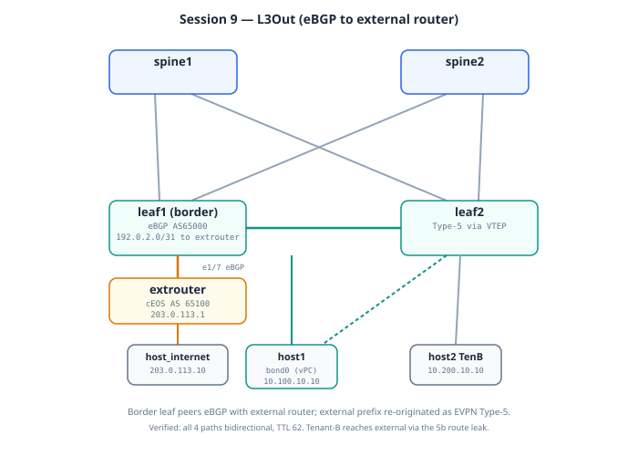

# Session 9: L3Out — Tenant VRF to External Router via eBGP

**Prerequisites**: Session 8 working. Topology change required —
adds extrouter (FRR) and host_internet containers.

**Goal**: Establish eBGP routing exchange between Tenant-A VRF on
leaf1 and an external router. External destinations become
reachable from any fabric leaf via EVPN Type-5 propagation. Fabric
prefixes become reachable from external networks.

**Lab folder**: `labs/09-l3out/`

**Estimated time**: 30-35 minutes

**Why this matters**: Every data center connects to something
outside the fabric — WAN, internet, firewalls, partner networks,
DMZ. L3Out is how that connectivity is established. It's the
fabric's "edge to the world."

---

## Bring-up

**Self-contained session (Model B)** — this topology adds the
`extrouter` and `host_internet` containers, so it deploys fresh rather
than layering on the running lab. See
[`DEPLOYMENT.md`](DEPLOYMENT.md).

```bash
cd ~/vxlan-evpn-zero-to-hero

# 1. Tear down whatever is running (point at the CURRENT topology):
containerlab destroy -t labs/<current-session>/topology.clab.yml --cleanup

# 2. Deploy this session's self-contained topology (~15 min).
#    extrouter (cEOS) loads its startup config at boot - no separate push
#    needed for it.
./scripts/deploy.sh 09-l3out

# 3. Wait for healthy, then push the NX-OS configs
watch -n 10 'docker ps --format "{{.Names}}\t{{.Status}}" | grep clab-vxlan'
./scripts/switch.sh 09-l3out

# 4. Configure hosts — see "Host setup" below. THREE hosts to set up:
#    host1 (LACP bond — inherits the vPC from Session 6), host2 (Tenant-B),
#    and host_internet (external). Then WAIT ~30s for LACP + eBGP before
#    testing, or host1 tests show false 100% loss.
```

> **Fresh deploy = all hosts blank** (Model B). host1, host2, and
> host_internet all come up with no IPs.

## Host setup

### host1 — MUST be an LACP bond (inherits vPC from Session 6) ⭐

Same trap as Session 8: leaf1's host1 port is a vPC member
(`channel-group 10 mode active`). A plain IP leaves it
`suspended (no LACP PDUs)` and host1 is unreachable — every test
involving host1 fails while host2/host_internet work, which is the
tell-tale signature.

```bash
docker exec clab-vxlan-evpn-host1 sh -c '
ip link set bond0 down 2>/dev/null
ip link delete bond0 2>/dev/null
ip link add bond0 type bond
echo 802.3ad > /sys/class/net/bond0/bonding/mode
echo fast > /sys/class/net/bond0/bonding/lacp_rate
echo 100 > /sys/class/net/bond0/bonding/miimon
ip link set eth1 down
ip link set eth2 down
ip addr flush dev eth1
ip addr flush dev eth2
ip link set eth1 master bond0
ip link set eth2 master bond0
ip link set eth1 up
ip link set eth2 up
ip link set bond0 up
ip addr add 10.100.10.10/24 dev bond0
ip route replace default via 10.100.10.1
'
```

### host2 — Tenant-B

```bash
docker exec clab-vxlan-evpn-host2 sh -c '
ip addr flush dev eth1
ip addr add 10.200.10.10/24 dev eth1
ip link set eth1 up
ip route replace default via 10.200.10.1
'
```

### host_internet — external host behind the L3Out router

```bash
docker exec clab-vxlan-evpn-host_internet sh -c '
ip addr flush dev eth1
ip addr add 203.0.113.10/24 dev eth1
ip link set eth1 up
ip route replace default via 203.0.113.1
'
```

> **⏳ Wait ~30 seconds after the host1 bond setup before testing.** LACP
> needs to converge *and* the eBGP sessions need to come up. Tests fired
> immediately show a false 100% loss on host1 specifically (you'll see
> `seq 0` dropped even on the gateway ping). Confirm readiness with:
> ```bash
> docker exec clab-vxlan-evpn-host1 ping -c 3 10.100.10.1   # want TTL 255, 0% loss
> ```
> If that's clean, host1's bond is up and you can run the L3Out tests.

## Topology (this session)




Base fabric + the L3Out edge (new nodes in caps):

```
            spine1            spine2
               |  \            /  |
             leaf1 == vPC == leaf2
              |  \             |  \
              | Eth1/7         | Eth1/7
              |    \           |    \
            hosts   +---------------+
            L2Out   |   EXTROUTER   |   eBGP AS 65000 <-> AS 65100
                    | (cEOS, AS 65100)
                    +---------------+
                          | eth3
                          | 203.0.113.1/24
                    HOST_INTERNET
                    203.0.113.10/24
```

| New link | A-side | B-side | Role |
|----------|--------|--------|------|
| L3Out 1 | leaf1 Eth1/7 | extrouter eth1 | routed, VRF Tenant-A, eBGP |
| L3Out 2 | leaf2 Eth1/7 | extrouter eth2 | routed, VRF Tenant-A, eBGP |
| External LAN | extrouter eth3 | host_internet eth1 | 203.0.113.0/24 |

> Note: the lab implements the **dual-attached** L3Out (both leaves
> peer with the external router) — the production pattern this doc's
> "Production patterns" section foreshadows. Decision 2 below
> describes the simpler single-attached variant the session was first
> designed around; the dual-attached build is what's deployed and
> tested.

---

## Mental model

In Session 8 we extended L2 (a single VLAN) out to a non-EVPN
switch. In Session 9 we extend L3 (a whole VRF's routing table)
out to a non-EVPN router.

```
                Tenant-A VRF
                    │
        ┌───────────┼─────────────────┐
        │           │                  │
      leaf1       leaf2                │
        │                              │
   Eth1/7                              │
   (in Tenant-A,                       │
    192.0.2.0/31)                      │
        │                              │
   eBGP AS 65000 ↔ AS 65100             │
        │                              │
   extrouter (FRR)                      │
        │                              │
   eth2 (203.0.113.1/24)               │
        │                              │
   host_internet (203.0.113.10/24)     │
        ↑                              │
        │                              │
   Reachable from anywhere in Tenant-A?
   YES — via EVPN Type-5 propagation
```

The pattern from the fabric's perspective:
1. leaf1 has a routed interface in VRF Tenant-A, talking eBGP to
   extrouter
2. leaf1 learns external prefixes (e.g., 203.0.113.0/24)
3. leaf1 redistributes those into EVPN as Type-5 routes
4. Other leaves install the Type-5 routes in their Tenant-A RIB
5. They reach external destinations via VXLAN to leaf1 (the "border
   leaf"), which then forwards to extrouter

Symmetric: leaf1 advertises fabric prefixes (10.100.10.0/24 etc.)
to extrouter. External networks can reach fabric hosts back through
leaf1.

---

## Architecture decisions for this session

**Decision 1: eBGP, not OSPF or static**

eBGP is the production standard for data center L3Out:
- Flexible policy control (route-maps, prefix-lists, communities)
- Scales to large external networks
- Same protocol as our underlay/overlay — your friends know it

OSPF L3Out exists in older designs. Static routes work for small,
stable external connectivity. We pick eBGP because it's what real
fabrics deploy.

**Decision 2: Single-attached to leaf1**

One leaf serves as "border leaf" for Tenant-A's L3Out. Other leaves
reach external via EVPN Type-5 → VXLAN to leaf1.

Production typically uses **dual-attached L3Out** for redundancy:
both leaves have their own eBGP sessions to (separate) external
routers. We'll mention this as a production pattern but not deploy
it in the lab to keep complexity manageable.

**Decision 3: Tenant-A only**

We extend only Tenant-A out. Tenant-B has no L3Out in this
session. That said — Session 5b's route leak means Tenant-B hosts
CAN reach external destinations by leaking to Tenant-A first.

**Decision 4: Routed physical interface (not sub-interface)**

leaf1's Eth1/7 becomes a routed L3 port assigned to Tenant-A VRF.
Standard pattern. Sub-interfaces (`Ethernet1/7.50`) are also valid
when you need multiple VRFs sharing one physical port — but we
don't here.

**Decision 5: External AS 65100**

Clearly distinct from any fabric ASN. Could be anything; we pick
65100 because it's outside our underlay/overlay AS range.

**Decision 6: FRR as the external router**

FRR (Free Range Routing) is a real BGP/OSPF stack widely used in
production. Lightweight, free, runs in a Docker container. From
leaf1's perspective, indistinguishable from a Cisco/Arista/Juniper
external router speaking standard eBGP.

In your real production fabric, the "external router" might be:
- A Cisco ASR1000 connecting to your WAN provider
- A Juniper MX series serving as your DMZ aggregator
- A Palo Alto firewall participating in BGP
- A cloud-provider's BGP edge (e.g., AWS Direct Connect router)

All look the same to the fabric — an eBGP neighbor in a tenant VRF.

---

## What we add on top of Session 8

**Topology changes** (in topology.clab.yml):
- New container: `extrouter` (using `frrouting/frr:latest` image)
- New container: `host_internet` (Linux, represents external host)
- New link: `leaf1:eth7 ↔ extrouter:eth1` (the L3Out)
- New link: `extrouter:eth2 ↔ host_internet:eth1`

**Config changes on leaf1 only** (leaves and spines unchanged
otherwise):
- New routed interface Eth1/7 in VRF Tenant-A, IP 192.0.2.0/31
- eBGP neighbor 192.0.2.1 (AS 65100) under `vrf Tenant-A` BGP context

**FRR config on extrouter**:
- eBGP to leaf1 (AS 65000)
- Advertises 203.0.113.0/24
- Black-hole route to 203.0.113.0/24 (Null0) so the route exists
  to be advertised

**No spine changes**: spines don't care about external prefixes
directly — they just propagate EVPN routes (including the Type-5
that carries 203.0.113.0/24).

**No leaf2 changes**: leaf2 learns 203.0.113.0/24 entirely through
EVPN Type-5 from leaf1. No L3Out-specific config needed on leaf2.

---

## Why EVPN Type-5 matters here

**Type-5** is the EVPN route type for IP prefixes (not just MACs or
hosts). When leaf1 receives 203.0.113.0/24 from extrouter via eBGP,
NX-OS sees it inside Tenant-A VRF. The `advertise l2vpn evpn` line
under the VRF tells NX-OS to **redistribute these routes into EVPN
as Type-5**.

Other leaves see the Type-5 route, install it in their Tenant-A
RIB. Now leaf2 knows: "to reach 203.0.113.0/24, send VXLAN to
10.0.1.100 (the shared VTEP); leaf1 will decap and forward to
extrouter."

This is "**asymmetric IRB**" at the EVPN layer — but symmetric
forwarding at the fabric layer because Tenant-A's L3VNI 50001
handles the inter-leaf transport.

---

## Key tests after deployment

### Test 1: eBGP session up

```
show bgp vrf Tenant-A ipv4 unicast summary
```

Expected: the extrouter neighbor (AS 65100) in Established state with
1+ prefix received. (The neighbor IP is one end of the P2P /31 — it may
show as `192.0.2.0` or `192.0.2.1` depending on which side; both are
valid.) **Observed: Established, 1 prefix.**

### Test 2: External route in Tenant-A RIB on leaf1

```
show ip route 203.0.113.0/24 vrf Tenant-A
```

Expected: via 192.0.2.1, tag 65100, bgp-external.

### Test 3: EVPN Type-5 propagation

```
show bgp l2vpn evpn route-type 5
```

Expected: 203.0.113.0/24 entry visible. RT matches Tenant-A's
L3VNI (65000:50001).

### Test 4: leaf2 reaches external via VXLAN

```
show ip route 203.0.113.0/24 vrf Tenant-A
```

(On leaf2.) Expected: via 10.0.1.100 (shared VTEP), encap: VXLAN,
segid: 50001.

### Test 5: End-to-end ping

```bash
docker exec clab-vxlan-evpn-host1 ping -c 3 203.0.113.10
docker exec clab-vxlan-evpn-host2 ping -c 3 203.0.113.10
```

Both should succeed — **observed TTL 62, 0% loss** once converged.
host2's path goes through the Session 5b route leak (Tenant-B → Tenant-A
→ external). If host1 shows 100% loss but host2 works, host1's bond
isn't up — re-run the bond setup and wait 30s (see Host setup).

### Test 6: External can reach fabric

```bash
docker exec clab-vxlan-evpn-host_internet ping -c 3 10.100.10.10
```

Expected: succeeds — **observed TTL 62, 0% loss**. extrouter learned
fabric subnets via eBGP from leaf1. Also test the return to host2:
`docker exec clab-vxlan-evpn-host_internet ping -c 3 10.200.10.10`
(reaches Tenant-B via the route leak).

---

## Production patterns we're foreshadowing

**Dual-attached L3Out**: For redundancy, both leaves run their own
eBGP sessions to (typically separate) external routers. EVPN
handles failover automatically — if leaf1's L3Out dies, Type-5 from
leaf2 takes over.

**BFD on the eBGP session**: Default BGP timers (180s hold) are too
slow for production. BFD (Bidirectional Forwarding Detection)
provides sub-second neighbor failure detection. Single command:
`neighbor X.X.X.X bfd` on both sides.

**Route policy / filtering**: Production L3Out ALWAYS has policy.
Common policies:
- Inbound from external: deny default-route (unless intentional),
  prefix-list of expected routes, community-based filtering
- Outbound to external: only advertise fabric-managed prefixes,
  deny re-advertising what we just learned

**Route reflection between border leaves**: When you have multiple
L3Out points, you might want each border leaf to know about other
border leaves' external routes. EVPN handles this naturally via
Type-5 — no extra config needed for this case.

**Default route injection**: Some L3Outs inject a default route
(0.0.0.0/0) into the fabric so internal hosts have a path to "the
internet." This is policy-driven and requires careful configuration
to avoid loops.

**VRF leaking with L3Out**: Combine Session 5b (VRF leaking) with
this session: Tenant-B hosts can reach external networks via
Tenant-A's L3Out, even though Tenant-B has no L3Out itself. Useful
for shared services (DNS, NTP, etc. behind a single L3Out).

---

## Control-plane verification — Type-5 anatomy

```bash
ssh admin@clab-vxlan-evpn-leaf2 'show bgp l2vpn evpn route-type 5' | head -30
```
Find `203.0.113.0/24`: **Gateway IP 0.0.0.0** means "attached at the
advertising VTEP — forward to the route's next-hop." A non-zero gateway
IP would mean recursive hand-off (e.g. a firewall behind the border
leaf). Confirm the install chain: the same prefix in
`show ip route vrf Tenant-A` on leaf2 shows next-hop = leaf1's VTEP
with `encap: VXLAN` — external route, fabric delivery.

---

## Day in the life of a packet — host1 pings 203.0.113.10 (leaves the fabric entirely)

Arrives TTL 62: three routers touch it (leaf-in, border re-route... actually count them below).

**Hop 1 — ingress leaf: Type-5 lookup.** WHAT: 203.0.113.0/24 in Tenant-A came from a **Type-5** (prefix) route, next-hop = the border VTEP. If host1's bond hashed to leaf2: encap L3VNI 50001 toward leaf1. WHY Type-5 not Type-2: the outside world has no per-host MAC/IP pairs to advertise — it hands over subnets. VERIFY: `show bgp l2vpn evpn route-type 5` (gateway IP 0.0.0.0 = attached at the advertiser), `show ip route 203.0.113.0/24 vrf Tenant-A`.

**Hop 2 — border leaf1: decap, route OUT of the overlay.** WHAT: VNI 50001 → Tenant-A; lookup says via 192.0.2.0 (the extrouter) — a plain routed interface. The packet leaves as ordinary IP; VXLAN is gone. WHY the VRF matters here: the eBGP session to the extrouter lives **inside Tenant-A** (`show bgp vrf Tenant-A ipv4 unicast summary`) — the handoff is per-tenant. VERIFY: that summary (Established, PfxRcd 1).

**Hop 3 — extrouter (cEOS): the outside world.** WHAT: routes to its connected 203.0.113.0/24, delivers to host_internet. It learned 10.100.10.0/24 via plain eBGP — it has no idea EVPN exists. WHY that's the design win: standard IP peering at the edge; the fabric's complexity never leaks out.

**The return — WHEN asymmetry appears.** The reply enters at leaf1, gets re-originated... no — it *routes* in Tenant-A toward host1: if host1's route points at the **vPC VIP**, the underlay may deliver the return to *either* vPC member. Full path symmetry is never guaranteed; only reachability is. Host2's version of this walk adds one more step at hop 1: the leak (its VRF imported the Type-5 through Tenant-A's RT).

---

## Quick review (flashcards)

Cover the right column.

| Question | Answer |
|----------|--------|
| What is L3Out? | Routed (eBGP) peering between a tenant VRF and an **external router**, so the fabric exchanges IP prefixes with the outside world (WAN, internet, firewall). The L3 equivalent of Session 8's L2Out. |
| How does an external subnet get into the fabric? | The border leaf learns it via **eBGP** from the external router, installs it in the tenant VRF, and re-originates it as an **EVPN Type-5** route so every leaf can reach it via the L3VNI. |
| Type-5 vs Type-2 here? | Type-5 carries the external **prefix** (203.0.113.0/24); it's prefix-granular, unlike Type-2's host-granular MAC/IP. External routing hands off as standard IP subnets. |
| Why does the remote leaf show the external route via the VTEP? | The border leaf re-originated the external prefix as Type-5 with itself (the shared VTEP 10.0.1.100) as next-hop; remote leaves reach it encapsulated in L3VNI 50001. |
| How does host2 (Tenant-B) reach the external host? | Via the Session 5b **route leak** — Tenant-B imports Tenant-A's RT, so the external prefix leaks into Tenant-B, then out the L3Out. |
| Why must host1 be an LACP bond? | It inherits the vPC from Session 6 (`channel-group 10 mode active`). Plain IP -> port `suspended (no LACP PDUs)` -> host1 unreachable. |
| host1 tests fail but host2 works — diagnosis? | host1's bond isn't up/converged. Re-run the bond setup, wait ~30s for LACP, confirm `host1 ping 10.100.10.1` = TTL 255. |

---

## What you should be able to explain after Session 9

1. The difference between L2Out (Session 8) and L3Out (this session)
2. What a "border leaf" is in a VXLAN-EVPN fabric
3. How EVPN Type-5 routes are different from Type-2 routes
4. Why other leaves don't need L3Out config — they learn external
   routes via EVPN
5. The trade-off between single-attached and dual-attached L3Out
6. Why production L3Out requires BFD and route policy

---

## Next

Session 10: Multi-Pod. Multiple VXLAN-EVPN pods stitched together
via an IPN (Inter-Pod Network). Each pod has its own spine-leaf
fabric; pods exchange routes via the IPN. The pattern for scaling
fabrics beyond a single rack-row or single building.

Session 11: Multi-Site. Geographically separated fabrics connected
via DCI (Data Center Interconnect). Adds Border Gateways (BGWs)
that re-originate routes across site boundaries. The pattern for
active-active multi-region data centers.
