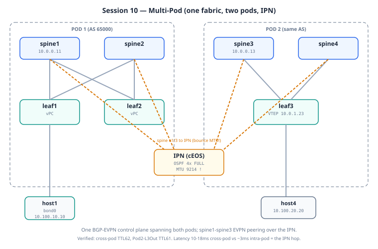

# Session 10: Multi-Pod — Stretching One Fabric Across Pods via an IPN

**Prerequisites**: Sessions 1–9 understood. This session is
**self-contained** (Model B) — one deploy brings up both pods. It does
not layer on a running base lab.

**Goal**: Take the single spine-leaf fabric and stretch it across **two
pods**. Pod 1 is the fabric you've built since Session 1; Pod 2 is a new
spine-leaf fabric (spine3, spine4, leaf3, host4). Between them sits an
**Inter-Pod Network (IPN)** providing plain IP underlay. EVPN routes flow
across the pod boundary unchanged, and a host in Pod 2 reaches Pod 1
hosts, Pod 1's L3Out, and Pod 1's L2Out transparently.

**Lab folder**: `labs/10-multipod/`

**Estimated time**: 40–50 minutes.

**Why this matters**: This is the architecture that scales a fabric
beyond a single rack-row or building while keeping it **one logical
fabric**. A bank's primary DC spanning four floors, a hyperscaler with
racks across multiple rooms — all of it runs multi-pod. Workloads move
freely between pods because, to EVPN, the pods are one fabric.

---

## Mental model

A single pod is a spine-leaf fabric with its own underlay. **Multi-Pod**
joins two (or more) such pods so they behave as one fabric — same VRFs,
same VNIs, same anycast gateways — while each pod keeps its own
spine-leaf structure and can scale independently.

```
        POD 1 (AS 65000)                       POD 2 (AS 65000)
   ┌────────────────────────┐            ┌────────────────────────┐
   │  spine1      spine2     │            │  spine3      spine4     │
   │    │  \      /  │       │    IPN     │    │  \      /  │       │
   │    │   \    /   │       │  (OSPF     │    │   \    /   │       │
   │  leaf1 == leaf2         │◄══area 0══►│       leaf3            │
   │    │       │            │  stretched │         │              │
   │  host1   host2          │   across)  │       host4            │
   │  L2Out / L3Out          │            │   (VLAN 20, Tenant-A)   │
   └────────────────────────┘            └────────────────────────┘
        own underlay                           own underlay
              \___________ same iBGP-EVPN AS 65000 ___________/
                  (full mesh between all four spines)
```

The crucial idea: **the pods share one iBGP-EVPN autonomous system**.
spine1–spine4 form a full mesh of EVPN sessions; each spine is the route
reflector for its own pod's leaves. A route originated in Pod 2 reaches
Pod 1's leaves because the Pod 2 spine sends it (iBGP) to the Pod 1
spine, which reflects it to its leaf clients.

The **IPN** does one job: route plain IP between the pod spines'
loopbacks so the underlay is reachable end-to-end. OSPF area 0 is
stretched from Pod 1 through the IPN into Pod 2. The IPN never sees
VXLAN or EVPN — it just forwards encapsulated packets as ordinary IP.

---

## Architecture decisions for this session

**Decision 1: Same iBGP-EVPN AS across pods**

Both pods are AS 65000. Inter-pod EVPN is iBGP, with a full mesh between
all four spines. This is the Cisco Multi-Pod reference design and the
cleanest to teach: no RT translation, no AS-path handling, no
eBGP boundary. A route from Pod 2 is imported in Pod 1 with exactly the
same RTs it was originated with.

Alternatives we're rejecting (and why): a **dedicated EVPN route server**
is cleaner at large scale but adds a box; **different AS per pod
(eBGP between pods)** is what very large deployments use for per-pod
policy and easier merge/split, but it's more machinery than 2–4 pods
need. We pick same-AS full-mesh because it teaches the concept with the
least overhead.

**Decision 2: Full mesh between all four spines**

iBGP route reflectors won't reflect a route received from one RR to
another RR. So if each spine is an RR for its pod, the spines must peer
**directly** with each other (full mesh) to exchange routes between pods.
For 2–4 pods this is a handful of sessions. Beyond ~6–8 pods the mesh
gets operationally heavy and you'd move to route servers or cluster IDs.

**Decision 3: IPN runs OSPF, not BGP**

The IPN only needs to route underlay IP — specifically, to make pod
spine loopbacks reachable across the boundary. OSPF area 0 stretched
across the IPN is the simplest way to do that. Production IPNs sometimes
run ISIS, or split each pod into its own OSPF area with the IPN as the
area-0 backbone — but the function is the same: underlay reachability for
spine loopbacks.

**Decision 4: Pod 2 has no L3Out or L2Out of its own**

Pod 2's host4 reaches the internet (via Pod 1's L3Out) and the external
L2Out host (behind Pod 1's leaf1) **through the fabric**. We deliberately
don't replicate edge services into Pod 2. This is the realistic
"centralized egress / border pod" pattern — one pod is designated for
external connectivity and the others reach it over the fabric.

---

## Topology and addressing




**Pod 1 (AS 65000):** spine1 (10.0.0.11), spine2 (10.0.0.12), leaf1
(10.0.0.21 / VTEP 10.0.1.21), leaf2 (10.0.0.22 / VTEP 10.0.1.22), plus
hosts and the L2Out/L3Out edge from Sessions 8–9.

**Pod 2 (AS 65000):** spine3 (10.0.0.13), spine4 (10.0.0.14), leaf3
(10.0.0.23 / VTEP 10.0.1.23), host4 (VLAN 20 / `10.100.20.0/24`).

**IPN:** a single cEOS device running OSPF area 0, with a /31 to each of
the four spines. Inter-pod underlay links:

| Link              | Subnet        |
|-------------------|---------------|
| spine1 ↔ IPN      | 10.30.1.0/31  |
| spine2 ↔ IPN      | 10.30.2.0/31  |
| spine3 ↔ IPN      | 10.30.3.0/31  |
| spine4 ↔ IPN      | 10.30.4.0/31  |

Pod 2 internal: spine3↔leaf3 (10.10.5.0/31), spine4↔leaf3 (10.10.6.0/31).

host4: VLAN 20, `10.100.20.20/24`, anycast gateway `10.100.20.1` (present
on leaf1, leaf2, **and** leaf3 — same IP, same anycast MAC).

```
   leaf1 ─┐                                       ┌─ leaf3 ─ host4
          ├ spine1 ─┐               ┌─ spine3 ────┤   (VLAN 20)
   leaf2 ─┘         ├─ IPN (OSPF) ──┤             │
          ┌ spine2 ─┘   area 0      └─ spine4 ────┘
   (Pod1 edge:                       (Pod2)
    L2Out/L3Out)     10.30.x.0/31 links
```

---

## What's special in the config

The interesting parts are all about joining the pods; the leaf/VRF/VNI
config is the same EVPN you already know.

**On Pod 1 spines (spine1, spine2):** add the IPN-facing interface and
iBGP-EVPN neighbors to the Pod 2 spines.

```
interface Ethernet1/3                 ! toward IPN
  mtu 9214                            ! see "Lessons" — cEOS caps at 9214
  ip ospf network point-to-point
  ip router ospf UNDERLAY area 0.0.0.0

router bgp 65000
  neighbor 10.0.0.13                  ! spine3 (Pod2)
    remote-as 65000
    update-source loopback0
    address-family l2vpn evpn
      send-community both
  neighbor 10.0.0.14                  ! spine4 (Pod2)
    ...
```

**On Pod 2 spines (spine3, spine4):** brought up as RRs for leaf3, with
iBGP-EVPN full-mesh back to the Pod 1 spines.

**On leaf3:** identical VRF / VNI / anycast-gateway config to the Pod 1
leaves — that's *why* the route leak, anycast gateway, and L3VNI all work
across pods with no special handling.

**No changes to leaf1 / leaf2.** From their perspective nothing changed —
they still peer iBGP-EVPN with spine1/spine2. The spines do the cross-pod
bridging.

---

## Bring-up

Self-contained (Model B). One deploy brings up both pods + the IPN.

```bash
cd ~/vxlan-evpn-zero-to-hero

# 1. Tear down any running lab (point at the CURRENT topology).
containerlab destroy -t labs/<current-session>/topology.clab.yml --cleanup
docker ps -a | grep clab-vxlan          # expect empty
free -h                                  # 7 N9000v need ~55 GB

# 2. Deploy this session's self-contained topology.
#    7 N9000v (spine1-4, leaf1-3) + IPN (cEOS) + hosts. ~15-20 min to boot.
./scripts/deploy.sh 10-multipod

# 3. Wait for the Nexus nodes. NOTE: with 7 N9000v booting at once, one
#    may stay (unhealthy) for a while — or get stuck unhealthy entirely
#    even though it works. Trust SSH over the healthcheck flag:
watch -n 10 'docker ps --format "{{.Names}}\t{{.Status}}" | grep clab-vxlan'
#    If a node is unhealthy past ~15 min, check it directly:
#      ssh admin@clab-vxlan-evpn-leaf3 'show version | include uptime'
#    If SSH answers, the node is usable (see "unhealthy but working" below).

# 4. Push configs.
./scripts/switch.sh 10-multipod

# 5. Fix the IPN MTU (REQUIRED on fresh deploy — see below) and confirm
#    OSPF goes FULL before any cross-pod test:
for s in spine1 spine2 spine3 spine4; do
  ssh admin@clab-vxlan-evpn-$s 'configure terminal ; interface Ethernet1/3 ; mtu 9214 ; end'
done
sleep 30
docker exec clab-vxlan-evpn-ipn Cli -p15 -c 'show ip ospf neighbor'   # want 4 FULL

# 6. Configure hosts (see "Host setup" below — host1 needs the LACP bond).
```

> **⚠️ The IPN MTU must be re-applied on fresh deploy.** The spine
> configs *contain* `mtu 9214` on the IPN interface (Ethernet1/3), but on
> N9000v the MTU often **doesn't take effect on the data plane until the
> interface bounces** — so a fresh deploy comes up with OSPF stuck in
> `EXCH START` (DBD exchange fails on the 9214-vs-9216 mismatch with
> cEOS). Re-applying `mtu 9214` (step 5) bounces it into effect and OSPF
> goes FULL. **No cross-pod traffic works until all 4 IPN neighbors are
> FULL.**
>
> **Toward a permanent fix (untested options):** to avoid the manual
> re-apply every deploy, you could (a) add an explicit `shutdown` /
> `no shutdown` on Ethernet1/3 at the end of each spine config so the
> MTU bounces during the push, or (b) investigate whether a fresh push
> ordering applies the MTU before `no shutdown`. Neither is verified yet
> — for now the reliable, known-good path is the manual re-apply in
> step 5.

> **"Unhealthy but working" (vrnetlab quirk).** On a heavy 7-node boot, a
> node (often the slowest leaf) can stay `(unhealthy)` forever because
> the vrnetlab launcher's status flag never flips from "starting" — even
> though NX-OS booted fine, answers SSH, and accepts config. The
> healthcheck (`uv run /healthcheck.py`) just keeps reporting "starting".
> `switch.sh` checks SSH (not the healthcheck), so it pushes fine. Trust
> SSH: if `ssh admin@clab-vxlan-evpn-<node> 'show version'` works, the
> node is usable regardless of the flag.

## Host setup

### host1 — LACP bond (Pod 1 vPC), Tenant-A

host1 is dual-homed to leaf1+leaf2 (the Pod 1 vPC pair, inherited from
Session 6), so it **must** be an LACP bond — a plain IP leaves the leaf
port `suspended (no LACP PDUs)` and host1 unreachable.

```bash
docker exec clab-vxlan-evpn-host1 sh -c '
ip link set bond0 down 2>/dev/null
ip link delete bond0 2>/dev/null
ip link add bond0 type bond
echo 802.3ad > /sys/class/net/bond0/bonding/mode
echo fast > /sys/class/net/bond0/bonding/lacp_rate
echo 100 > /sys/class/net/bond0/bonding/miimon
ip link set eth1 down
ip link set eth2 down
ip addr flush dev eth1
ip addr flush dev eth2
ip link set eth1 master bond0
ip link set eth2 master bond0
ip link set eth1 up
ip link set eth2 up
ip link set bond0 up
ip addr add 10.100.10.10/24 dev bond0
ip route replace default via 10.100.10.1
'
```

### host4 — Pod 2, single-homed to leaf3, plain IP

```bash
docker exec clab-vxlan-evpn-host4 sh -c '
ip addr flush dev eth1
ip addr add 10.100.20.20/24 dev eth1
ip link set eth1 up
ip route replace default via 10.100.20.1
'
```

### host2 — Tenant-B (for the cross-pod + cross-tenant test)

```bash
docker exec clab-vxlan-evpn-host2 sh -c '
ip addr flush dev eth1
ip addr add 10.200.10.10/24 dev eth1
ip link set eth1 up
ip route replace default via 10.200.10.1
'
```

### host_internet — external (for the L3Out-from-Pod2 test)

```bash
docker exec clab-vxlan-evpn-host_internet sh -c '
ip addr flush dev eth1
ip addr add 203.0.113.10/24 dev eth1
ip link set eth1 up
ip route replace default via 203.0.113.1
'
```

> **Wait ~30s after the host1 bond setup before testing** — LACP needs to
> converge or host1 tests show a false 100% loss (the `seq 0` drop).
> Confirm with `docker exec clab-vxlan-evpn-host1 ping -c 3 10.100.10.1`
> (want TTL 255).

---

## Key tests after deployment

### Test 1: OSPF FULL across the IPN

```
docker exec clab-vxlan-evpn-ipn Cli -p15 -c 'show ip ospf neighbor'
```

Expected: **four** FULL neighbors — spine1, spine2, spine3, spine4. If
any stick in `EXCH START`, it's almost certainly MTU (see Lessons).

### Test 2: Underlay reaches the far pod's spine loopbacks

```
show ip route 10.0.0.13            (on spine1 — spine3's loopback)
```

Expected: reachable via the IPN. Underlay established end-to-end.

### Test 3: iBGP-EVPN full mesh between spines

```
show bgp l2vpn evpn summary        (on spine1)
```

Expected: four neighbors Established — leaf1, leaf2 (Pod 1 clients) and
spine3, spine4 (Pod 2 spines).

### Test 4: First cross-pod ping — the headline

```bash
docker exec clab-vxlan-evpn-host1 ping -c 3 10.100.20.20
```

Expected/observed: **TTL 62, 0% loss** (after first-packet ARP). host1 (Pod 1) → host4 (Pod 2), same
Tenant-A, via cross-pod VXLAN over the IPN. The packet goes leaf1 →
spine1 → IPN → spine3 → leaf3 → host4; the two TTL decrements are the
two leaf SVIs.

### Test 5: Cross-pod, cross-tenant via leak

```bash
docker exec clab-vxlan-evpn-host4 ping -c 3 10.200.10.10
```

Expected/observed: **TTL 62**. host4 (Pod 2, Tenant-A) → host2 (Pod 1,
Tenant-B). Exercises the Session 5b route leak across pods — with **zero**
cross-pod-specific config, because RT semantics are fabric-global.

### Test 6: Pod 2 → L3Out (centralized egress)

```bash
docker exec clab-vxlan-evpn-host4 ping -c 3 203.0.113.10
```

Expected/observed: **TTL 61** (one extra hop vs intra-pod). host4 reaches "the internet" through Pod 1's
L3Out — leaf3 learned `203.0.113.0/24` via EVPN Type-5 from leaf1, tunnels
to leaf1, which hands off to extrouter.

### Test 7: External → Pod 2

```bash
docker exec clab-vxlan-evpn-host_internet ping -c 3 10.100.20.20
```

Expected: succeeds. extrouter knows `10.100.20.0/24` lives in the fabric
(via leaf1/leaf2 ECMP); once the packet enters the fabric, EVPN routes it
cross-pod to leaf3. extrouter has no idea VXLAN or multi-pod exist.

---

## Lessons from the build

**1. MTU mismatch is the #1 Multi-Pod gotcha — AND it needs a bounce.**
On fresh deploy, OSPF on the IPN sticks in `EXCH START` — the state where OSPF tries to exchange
its database and fails. The cause: the spines' IPN-facing interfaces were
at MTU **9216** (NX-OS jumbo default), but **cEOS caps at 9214**. Two
bytes, and OSPF refused to form the adjacency (OSPF requires identical
MTU on a point-to-point link). Fix: drop the spine IPN interfaces to
**9214** to match cEOS. **Subtle part:** the spine configs already
*contain* `mtu 9214` on Ethernet1/3, but on N9000v the MTU often doesn't
take effect on the data plane until the interface **bounces** — so even
with the right config, a fresh deploy comes up broken until you re-apply
the MTU (which bounces it). Always re-apply `mtu 9214` and confirm 4 FULL
before testing. This is verified, not theoretical — it happened on every
clean deploy.

> Production lesson: when you connect a Cisco fabric to any non-Cisco
> device, **check MTU first**. The whole path is limited by the smallest
> MTU in it. For VXLAN you need at least payload + 50 bytes of overhead
> (8 VXLAN + 8 UDP + 20 IP + 14 Ethernet). Standardize the fabric MTU
> *before* deploying; discovering mismatches later means weeks of chasing
> phantom fragmentation bugs. If you ever see OSPF stuck in EXCH START,
> check MTU, then check it again.

**2. Same-AS Multi-Pod is genuinely simple once the underlay is up.**
After OSPF went FULL across the IPN and the spine full-mesh
iBGP-EVPN sessions established, *everything else worked with no
cross-pod-specific config*. The Session 5b route leak just worked across
pods. The anycast gateway just worked across pods. The Session 9 L3Out
became reachable from Pod 2 just because EVPN Type-5 doesn't care which
pod a route came from. That's the elegance of RT-based propagation — the
semantics are global.

**3. Spine full-mesh is right for 2–4 pods, wrong for many.** The mesh is
N·(N−1)/2 sessions. At four spines that's six sessions — trivial. At a
dozen pods it's painful, and that's when route servers or cluster IDs
earn their keep.

**4. TTL tells the packet's story.** Intra-pod TTL 63, cross-pod TTL 62
(one extra leaf SVI), cross-pod + L3Out TTL 61 (one more hop at the
border). Reading TTL decrements is a quick way to *see* the path a packet
took.

---

## Production patterns we're foreshadowing

**Redundant IPN.** We run a single IPN; lose it and the pods are isolated
(though each pod keeps working internally). Production runs dual IPN
devices, each spine connected to both, with failover at the underlay
routing layer.

**Per-pod OSPF areas.** Stretching one area 0 across pods is the lab
simplification. Production often makes each pod its own area with the IPN
as the area-0 backbone, limiting LSA flooding blast radius.

**eBGP between pods at scale.** Beyond a handful of pods, the same-AS
full mesh gives way to per-pod ASNs with eBGP between spines — per-pod
policy, AS-path loop prevention, easier to merge or split pods. This is
the conceptual bridge to Session 11's Multi-Site, where the sites are
genuinely separate ASNs.

**Heterogeneous pods.** Don't oversell "Pod 2 is just a smaller Pod 1."
In reality pods are often different ages, NX-OS versions, and hardware —
Multi-Pod is a migration pattern as much as a scale pattern. You can
stand up a new pod with a newer design while old pods keep running.

---

## Control-plane verification — one control plane, two pods

```bash
docker exec clab-vxlan-evpn-ipn Cli -p15 -c 'show ip ospf neighbor'   # 4x FULL first!
ssh admin@clab-vxlan-evpn-spine1 'show bgp l2vpn evpn summary'        # spine3 (10.0.0.13) Established
ssh admin@clab-vxlan-evpn-leaf1  'show bgp l2vpn evpn 10.100.20.20' | grep -i next
```
The Multi-Pod signature: host4's route on a Pod-1 leaf carries **leaf3's
original VTEP as next-hop, unmodified** — one continuous tunnel, one
fault domain. Contrast with Session 11, where the border *rewrites* the
next-hop. That single field is the Pod-vs-Site difference made visible.

---

## Day in the life of a packet — host1 (Pod 1) pings host4 (Pod 2)

Arrives TTL 62 — the SAME hop count as intra-pod Session 4. That's the headline: Multi-Pod adds distance, not routing hops.

**Hop 1 — leaf1: nothing special.** WHAT: 10.100.20.20 is a Type-2 in Tenant-A, next-hop = **leaf3's own VTEP (10.0.1.23)**, encap L3VNI 50001. WHY unremarkable: one BGP control plane spans both pods — leaf3's routes arrive with their original next-hop intact (spine1↔spine3 EVPN peering over the IPN just relays them). VERIFY: `show bgp l2vpn evpn 10.100.20.20 | grep -i next` (next-hop 10.0.1.23, unmodified).

**Hops 2–4 — the underlay stretch: spine1 → IPN → spine3.** WHAT: the OUTER packet (10.0.1.100→10.0.1.23) rides ordinary OSPF routing across the IPN; the VXLAN tunnel passes *through* unopened. WHY latency jumps (10–18 ms vs ~3 ms): more physical hops, same logical tunnel. WHEN this path doesn't exist: IPN OSPF stuck in EXCH START (the MTU 9214 bounce) — the tunnel has no road. VERIFY: `docker exec clab-vxlan-evpn-ipn Cli -p15 -c 'show ip ospf neighbor'` (4x FULL), traceroute the outer path if curious.

**Hop 5 — leaf3: decap and deliver** exactly as Session 4's egress. One fault domain, one tunnel, TTL only ever touched twice. Contrast with the next session, where the border **opens** the tunnel — and the next-hop changes.

---

## Quick review (flashcards)

Cover the right column.

| Question | Answer |
|----------|--------|
| What is the IPN and why does Multi-Pod need it? | The **Inter-Pod Network** — an underlay router (here cEOS) joining the two pods' spines via OSPF. It carries VTEP-to-VTEP reachability *between* pods so VXLAN tunnels can span them. |
| Why does OSPF stick in `EXCH START` on fresh deploy? | **MTU mismatch** on the IPN link — spines default 9216, cEOS caps at 9214. The DBD exchange fails. Fix: `mtu 9214` on the spine IPN interfaces (and bounce). |
| The config already has `mtu 9214` — why still broken? | On N9000v the MTU may not hit the data plane until the interface **bounces**. Re-applying the command bounces it into effect. |
| Why is cross-pod latency ~10-18ms vs ~3ms intra-pod? | Cross-pod traffic traverses the **IPN** (leaf→spine→IPN→spine→leaf), several more hops than staying inside one pod. The RTT jump is the visible proof the pods are separate. |
| Cross-pod ping shows TTL 62, but host4→external shows TTL 61 — why? | TTL = number of routed hops. Same-tenant cross-pod = 2 leaf routings (62). Pod2→external adds the L3Out hop in Pod1 (61). |
| Why must host1 be an LACP bond here? | Pod 1 inherits the Session 6 vPC; host1 is dual-homed to leaf1+leaf2. Plain IP → port suspended → unreachable. |
| A node shows `(unhealthy)` but answers SSH — usable? | Yes. The vrnetlab launcher status flag is stuck at "starting"; NX-OS is fine. `switch.sh` uses SSH, not the flag. Trust SSH. |

---

## What you should be able to explain after Session 10

1. Why multi-pod exists — scaling one logical fabric beyond a single
   rack-row or building.
2. What the IPN actually does (plain IP underlay routing of spine
   loopbacks) and why OSPF is enough.
3. Why same-AS full-mesh works for 2–4 pods, and when you'd move to eBGP
   between pods or route servers.
4. How to debug OSPF stuck in `EXCH START` — check MTU first.
5. Why the route leak, anycast gateway, and L3Out all work across pods
   with no cross-pod-specific config.

---

## Next

Session 11: Multi-Site. Multi-Pod stretched **one** fabric across pods,
sharing an AS and an underlay. Multi-Site connects **different** fabrics —
each its own AS and underlay — with translation and re-origination at the
boundary via Border Gateways. Same building blocks, a fundamentally
different isolation model.
