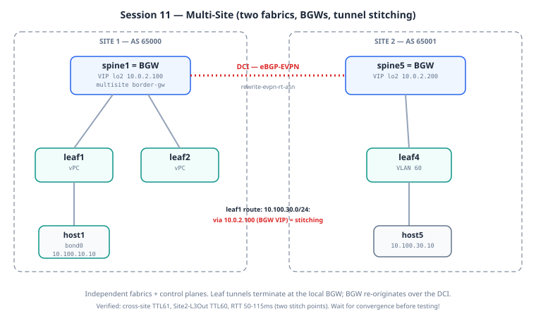

# Session 11: Multi-Site — Two Fabrics Joined via Border Gateways + DCI

**Prerequisites**: Sessions 1–9 understood. This session is
**self-contained** (Model B) — one deploy brings up both sites. It does
not layer on a running base lab.

**Goal**: Connect two independent VXLAN-EVPN fabrics — each its own
autonomous system, each its own underlay — into one stretched overlay.
A host in Site 1 (AS 65000) reaches a host in Site 2 (AS 65001) across a
Data Center Interconnect (DCI), with EVPN routes carried between sites
and VXLAN tunnels stitched at the boundary.

**Lab folder**: `labs/11-multisite/`

**Estimated time**: 45–60 minutes (longer if you debug — this is the
hardest session in the curriculum).

**Why this matters**: Multi-Pod (Session 10) scales a fabric within one
administrative domain — one big OSPF underlay, one BGP AS, stretched
across pods. Multi-Site is for when that's too much blast radius: two
geographically separated data centers that must share workloads but
stay **fault-isolated**. A problem in Site 1's underlay must not ripple
into Site 2. Multi-Site is the active-active multi-region pattern banks
and hyperscalers actually deploy.

---

## Mental model

In Multi-Pod, the pods share everything — same AS, same underlay IGP,
stretched across an IPN. The pods are really one fabric in two rooms.

In **Multi-Site**, each site is a **separate fabric** that happens to be
glued to another fabric at a controlled seam:

```
        SITE 1 (AS 65000)                 SITE 2 (AS 65001)
   ┌───────────────────────┐         ┌───────────────────────┐
   │   spine1 = SPINE+BGW   │         │   spine5 = SPINE+BGW   │
   │      /         \       │         │          │            │
   │   leaf1 ===== leaf2    │   DCI   │        leaf4           │
   │   (vPC pair)           │◄═══════►│                        │
   │     │      │           │ eBGP-   │          │             │
   │   host1  host2         │ EVPN    │        host5           │
   │   L2Out  L3Out         │         │   (VLAN 60 native)     │
   └───────────────────────┘         └───────────────────────┘
        own underlay                       own underlay
        own AS                             own AS
```

The seam is the **Border Gateway (BGW)**. It does three jobs:

1. **Terminates** its own site's VXLAN tunnels (it's a VTEP).
2. **Re-originates** EVPN routes across the DCI — taking a route learned
   inside Site 1 and re-advertising it into Site 2 (and vice versa),
   rewriting the route's identity so each site sees it as locally sourced.
3. **Hides** each site's internal VTEPs from the other site. Site 2 never
   sees Site 1's individual leaf VTEPs — it only sees Site 1's BGW. That
   hiding is what gives you fault isolation.

The keystone concept: **the BGW advertises cross-site routes with its
own "Virtual IP" (VIP) loopback as the next-hop**, not the original
leaf's VTEP. A host in Site 2 sending to Site 1 tunnels to Site 1's BGW
VIP; the BGW decapsulates and re-encapsulates toward the real leaf
inside Site 1. Two VXLAN segments stitched at the seam — never one tunnel
end-to-end.

---

## Architecture decisions for this session

**Decision 1: Collapsed spine + BGW (not dedicated BGW nodes)**

In a textbook Multi-Site diagram the BGW is a separate box hanging off
the spine. We **collapse the BGW function into the spine** — spine1 *is*
Site 1's BGW, spine5 *is* Site 2's BGW.

Why: it's a legitimate, common production design for two-site
deployments (fewer boxes, less cost), **and** it removes an extra
route-reflector hop. With a separate BGW behind the spine, a
re-originated route has to travel BGW → spine → leaf, and the spine's
reflection of that re-originated route is where things broke in testing
(see "Lessons from the build"). Collapsing the roles means the BGW
reflects directly to its leaf clients — no lost hop.

Trade-off: one less layer of redundancy (the spine is now also the site's
single BGW). For a lab and for many real two-site builds, that's fine.
Large deployments use a dedicated BGW **pair** per site.

**Decision 2: Each site is its own AS**

Site 1 is AS 65000, Site 2 is AS 65001. The DCI between BGWs is
**eBGP-EVPN** (between the two ASNs). Inside each site it's still
iBGP-EVPN with the spine as route reflector. Separate ASNs are what make
the sites independent — neither site's IGP or iBGP mesh extends into the
other.

**Decision 3: eBGP-EVPN on the DCI, with RT rewrite**

The cross-site session carries the L2VPN EVPN address family between
ASNs. Because route-targets are auto-derived from the local ASN
(`65000:VNI` in Site 1, `65001:VNI` in Site 2), a route crossing the DCI
would carry the *wrong* RT for the receiving site. `rewrite-evpn-rt-asn`
on the DCI neighbor translates the ASN portion of the RT as the route
crosses — `65000:50001` becomes `65001:50001` and the receiving site
imports it correctly.

**Decision 4: L3-only stretch for the cross-site subnet**

Site 2's host5 lives in VLAN 60 / `10.100.30.0/24`. VLAN 60 exists
**only in Site 2**. We stretch Tenant-A's *routing* (the L3VNI 50001)
across the sites, not the L2 broadcast domain. So host1 (Site 1) reaches
host5 (Site 2) by **routing** through the BGWs, not by sharing a VLAN.
This is the cleaner, more common Multi-Site pattern — L2 stretch across
sites is possible but invites cross-site flooding and is usually avoided.

**Decision 5: OSPF extended across the DCI (lab simplification)**

For VXLAN tunnels to form between sites, each BGW must be able to *reach*
the other BGW's VIP/PIP loopbacks in the underlay — the EVPN next-hop has
to resolve. In this lab we simply extend the underlay OSPF across the DCI
link so the loopbacks are mutually reachable.

In **production this is wrong** — it merges the two sites' underlays and
breaks the fault isolation Multi-Site exists to provide. The production
pattern advertises *only* the specific BGW loopbacks across the DCI via
**BGP IPv4 unicast**, keeping each site's OSPF domain separate. We use
OSPF-across-DCI purely to keep the lab small; the teaching note here is
to **not** copy that into a real design.

---

## Topology and addressing




**Site 1 (AS 65000):**

| Node    | Role            | lo0 (RID) | lo1 (VTEP/PIP) | lo2 (VIP) |
|---------|-----------------|-----------|----------------|-----------|
| spine1  | spine + **BGW** | 10.0.0.11 | 10.0.1.11      | 10.0.2.100|
| leaf1   | leaf (vPC)      | 10.0.0.21 | 10.0.1.21 (+ 10.0.1.100 anycast) | — |
| leaf2   | leaf (vPC)      | 10.0.0.22 | 10.0.1.22 (+ 10.0.1.100 anycast) | — |

Hosts: host1 (vPC bond, VLAN 10), host2 (VLAN 30 / Tenant-B), host3
(behind L2Out), host_internet (behind L3Out via extrouter / cEOS).

**Site 2 (AS 65001):**

| Node    | Role            | lo0 (RID) | lo1 (VTEP/PIP) | lo2 (VIP) |
|---------|-----------------|-----------|----------------|-----------|
| spine5  | spine + **BGW** | 10.0.0.15 | 10.0.1.15      | 10.0.2.200|
| leaf4   | leaf            | 10.0.0.24 | 10.0.1.24      | — |

Host: host5 (VLAN 60 / Tenant-A / `10.100.30.0/24`).

**DCI:** spine1 Eth1/3 (`192.168.100.0/31`) ↔ spine5 Eth1/3
(`192.168.100.1/31`). eBGP-EVPN between AS 65000 and AS 65001, plus OSPF
for loopback reachability.

**Cross-site Tenant-A L3VNI:** 50001 (carried in both sites).

```
        Site 1 (AS 65000)                      Site 2 (AS 65001)

   host1 ─ leaf1 ┐                                      ┌ leaf4 ─ host5
                 ├─ spine1 ════════ DCI ════════ spine5 ┤      (VLAN 60,
   host2 ─ leaf2 ┘  (BGW)      eBGP-EVPN + OSPF   (BGW)  └       10.100.30.0/24)
                 │   VIP                          VIP
            L2Out/L3Out      192.168.100.0/31
                            10.0.2.100  ◄──►  10.0.2.200
```

---

## What's special in the config

These are the lines that make Multi-Site work — the rest is the same
EVPN you've built since Session 3.

**On each BGW (spine1, spine5):**

```
evpn multisite border-gateway 1          ! site-id (1 on spine1, 2 on spine5)
  delay-restore time 30

interface loopback2
  ip address 10.0.2.100/32               ! the BGW VIP (10.0.2.200 on spine5)
  ip router ospf UNDERLAY area 0.0.0.0

interface nve1
  source-interface loopback1                       ! PIP
  multisite border-gateway interface loopback2      ! VIP

interface Ethernet1/1                    ! fabric-facing uplink(s)
  evpn multisite fabric-tracking

interface Ethernet1/3                    ! DCI
  ip ospf network point-to-point
  ip router ospf UNDERLAY area 0.0.0.0   ! lab-only: underlay across DCI
  evpn multisite dci-tracking

router bgp 65000
  neighbor 192.168.100.1                 ! the other site's BGW
    remote-as 65001
    address-family l2vpn evpn
      rewrite-evpn-rt-asn                 ! translate RT ASN across the seam
```

**The next-hop rewrite (the fix that makes it actually forward):**

```
ip as-path access-list SITE2-ASPATH seq 10 permit "65001"

route-map SET-NH-VIP permit 10
  match as-path SITE2-ASPATH             ! only cross-site routes
  set ip next-hop 10.0.2.100             ! this BGW's own VIP
route-map SET-NH-VIP permit 20           ! everything else: untouched

router bgp 65000
  neighbor 10.0.0.21                      ! to leaf1
    address-family l2vpn evpn
      route-map SET-NH-VIP out
  neighbor 10.0.0.22                      ! to leaf2
    address-family l2vpn evpn
      route-map SET-NH-VIP out
```

(spine5 mirrors this: match AS-path `65000`, set next-hop `10.0.2.200`,
applied outbound to leaf4.)

Read the "Lessons from the build" section for **why** that route-map is
necessary — it's the crux of the whole session.

---

## Bring-up

Self-contained (Model B). One deploy brings up both sites.

```bash
cd ~/vxlan-evpn-zero-to-hero

# 1. Tear down any running lab (frees RAM, avoids node-name clashes).
containerlab destroy -t labs/01-underlay/topology.clab.yml --cleanup
docker ps -a | grep clab-vxlan          # expect empty

# 2. Deploy this session's self-contained topology.
#    Boots 5 N9000v (spine1, spine5, leaf1, leaf2, leaf4) + extrouter (cEOS)
#    + 5 Alpine hosts. ~15 min for the Nexus nodes to pass healthcheck.
./scripts/deploy.sh 11-multisite

# 3. Wait for all Nexus nodes healthy.
watch -n 10 'docker ps --format "{{.Names}}\t{{.Status}}" | grep clab-vxlan'

# 4. Push configs + set up hosts + run the 7 cross-site tests.
#    deploy-final.sh wraps switch.sh, host NIC setup, convergence wait, and tests.
./scripts/deploy-final.sh
```

> **Give it time.** After the config push, the DCI eBGP-EVPN session and
> **Don't trust the first test run — verify convergence first.** On a
> live retest, the smoke pings all failed 100% when run ~90 s after the
> final push: spine1 showed leaf1/leaf2 **Idle** in `show bgp l2vpn evpn
> summary` and the NVE showed `Fabric convergence time left: 24 seconds`.
> Everything was correctly configured — BGP was simply still
> re-establishing. Minutes later, all four tests passed unchanged. Before
> declaring failure, confirm: (a) spine's leaf neighbors **Established**
> with PfxRcd > 0, (b) `Fabric convergence time left: 0`, (c) then test.
>
> `delay-restore` need ~60 s. `deploy-final.sh` already sleeps 60 s before
> testing. If cross-site tests fail on the very first run, wait another
> minute and re-run just the pings before debugging.

---

## Key tests after deployment

### Test 1: Underlay reaches the far BGW loopbacks

```
show ip route 10.0.1.15            (on spine1 — Site 2's PIP)
show ip route 10.0.2.200           (on spine1 — Site 2's VIP)
```

Expected: both reachable via `192.168.100.1, Eth1/3, ospf-UNDERLAY`. If
these are missing, the DCI OSPF isn't up and **nothing cross-site will
forward** — fix this first.

### Test 2: DCI eBGP-EVPN session up

```
show bgp l2vpn evpn summary        (on spine1)
```

Expected: neighbor `192.168.100.1` (AS 65001) Established, with prefixes
received. Plus the two leaf clients (10.0.0.21, 10.0.0.22) Established.

### Test 3: BGW is in Multi-Site mode with VIP active

```
show nve interface nve1 detail     (on spine1)
```

Expected: `Multisite bgw-if: loopback2 (ip: 10.0.2.100, ... oper: Up)`
and `Multisite delay-restore time left: 0 seconds`.

### Test 4: Cross-site VTEP visible

```
show nve peers                     (on leaf1)
```

Expected: among the peers, `10.0.1.15` — Site 2's BGW VTEP. That's the
stitched cross-site tunnel endpoint.

### Test 5: The cross-site route has the RIGHT next-hop

```
show ip route 10.100.30.0/24 vrf Tenant-A     (on leaf1)
```

Expected: `*via 10.0.2.100` (Site 1's BGW VIP) — **not** `192.168.100.1`.
If you see the DCI interface IP as the next-hop here, the next-hop rewrite
route-map isn't doing its job and pings will fail. This single line is the
difference between working and not (see Lessons).

### Test 6: End-to-end cross-site pings

```bash
docker exec clab-vxlan-evpn-host1 ping -c 3 10.100.30.10   # Site1 → Site2
docker exec clab-vxlan-evpn-host5 ping -c 3 10.100.10.10   # Site2 → Site1
docker exec clab-vxlan-evpn-host5 ping -c 3 203.0.113.10   # Site2 → L3Out (via Site1)
```

**Observed on the verified run:** Site1→Site2 and Site2→Site1 **TTL 61**;
Site2→L3Out and external→Site2 **TTL 60** (the two longest paths in the
curriculum). RTTs are noticeably higher than Multi-Pod (**~50–115 ms** vs
10–18 ms cross-pod): every cross-site packet is decapsulated and
re-encapsulated at *two* BGWs (tunnel stitching), and that shows up in
latency. The leaf1 route check is the signature of Multi-Site working:

```bash
ssh admin@clab-vxlan-evpn-leaf1 'show ip route 10.100.30.0/24 vrf Tenant-A'
# *via 10.0.2.100%default ... segid: 50001 encap: VXLAN
#      ^^^^^^^^^^ Site2's BGW VIP — NOT the DCI address (192.168.100.1).
# The BGW re-originated the route with itself as next-hop = tunnel stitching.
docker exec clab-vxlan-evpn-host_internet ping -c 3 10.100.30.10  # external → Site2
```

All four should succeed. The last two are the impressive ones: a Site 2
host reaching the internet through Site 1's L3Out, and an external host
reaching Site 2 through Site 1's border — traffic crossing the DCI in
both directions.

---

## Lessons from the build

This session was genuinely hard to get forwarding end-to-end. Three
distinct problems had to be solved in sequence. Each is worth
understanding because each teaches something real about Multi-Site.

**1. The underlay must reach the far BGW's loopbacks.**

The DCI started as eBGP-EVPN only — control plane, no underlay. The EVPN
session came up, routes were exchanged, everything *looked* healthy. But
the EVPN next-hops (the BGW loopbacks) were **unreachable** across the
DCI, so no VXLAN tunnel could form and data plane silently failed.

Symptom: `show bgp l2vpn evpn` healthy, but cross-site pings 100% loss,
and the route's next-hop marked as not installed.

Fix: extend underlay reachability across the DCI (we use OSPF; production
uses BGP IPv4-unicast advertising just the loopbacks). **EVPN gives you
the route; the underlay still has to give you the path to the next-hop.**

**2. The extra route-reflector hop ate the re-originated route.**

With a *separate* BGW behind the spine, a re-originated cross-site route
had to go BGW → spine (RR) → leaf. The re-originated route uses a
secondary route-distinguisher, and that path through the standalone spine
RR is where it got dropped in this NX-OS image — the leaves never saw it.

Fix: **collapse the BGW into the spine** (Decision 1). Now the BGW
reflects re-originated routes directly to its leaf clients. No lost hop.
This is why the lab uses spine-as-BGW rather than a dedicated BGW node.

**3. The BGW didn't rewrite the next-hop to its VIP — so we forced it.**

Even with 1 and 2 solved, the cross-site route reached the leaves with
the **DCI interface IP** (`192.168.100.1`) as its next-hop — not the
BGW's VIP. On real hardware the BGW rewrites the next-hop to its VIP
automatically. In this virtual N9000v image, that automatic rewrite
didn't happen, so the leaf tried to build a VXLAN tunnel to
`192.168.100.1` — which is a routed link IP, not a VTEP. Tunnel never
formed; pings failed.

Symptom: Test 5 shows `*via 192.168.100.1` instead of `*via 10.0.2.100`.

Fix: an explicit outbound route-map on the BGW's fabric-facing
iBGP-EVPN sessions that sets the next-hop to the BGW's own VIP, matched
by AS-path so **only** cross-site routes are rewritten (intra-site routes
must keep their original leaf VTEP next-hop and are left untouched by the
`permit 20` clause):

```
route-map SET-NH-VIP permit 10
  match as-path SITE2-ASPATH       ! routes that came from the other site
  set ip next-hop 10.0.2.100       ! this BGW's VIP
route-map SET-NH-VIP permit 20     ! all other routes: unchanged
```

The moment that landed, all four cross-site tests passed. The
next-hop in Test 5 flipped from `192.168.100.1` to `10.0.2.100`, the
tunnel formed to a real VTEP, and traffic flowed.

> **The meta-lesson:** in EVPN, "the control plane is up" is not "the data
> plane works." Three times here the BGP session was perfectly healthy
> while traffic black-holed — each time because the **next-hop wasn't
> resolvable as a real VTEP**. When a Multi-Site data plane fails, look at
> the next-hop of the cross-site route first, and ask: *is that an address
> the fabric can build a VXLAN tunnel to?*

---

## Production patterns we're foreshadowing

**Dedicated BGW pair per site.** Production runs **two** BGWs per site
(an anycast VIP shared across the pair) for redundancy. The VIP we
configured is exactly the mechanism that makes a BGW *pair* look like one
VTEP to the remote site — here we just have one BGW carrying it.

**Underlay isolation across the DCI.** Replace OSPF-across-DCI with BGP
IPv4-unicast advertising only the BGW loopbacks. Each site keeps its own
OSPF domain. This is the whole point of Multi-Site — a fault in one
site's underlay must not propagate to the other.

**DCI peering on loopbacks with multihop.** Production peers the DCI
eBGP-EVPN session between dedicated loopbacks (with `ebgp-multihop`)
rather than physical interface IPs, so the control plane survives any one
DCI link failing.

**Selective L2 stretch.** We stretched only L3. When a workload genuinely
needs the same broadcast domain in both sites (clustering, some
load-balancer designs), you stretch a specific L2VNI across the DCI — but
deliberately, per-VNI, with storm control, never wholesale.

**BUM replication across sites.** Broadcast/unknown-unicast/multicast
handling across the DCI uses the BGW's multisite ingress-replication.
Tuning this (and avoiding cross-site flooding) is a real operational
concern at scale.

---

## Control-plane verification — stitching, proven in the table

```bash
# 1) BGW-to-BGW eBGP-EVPN across the DCI:
ssh admin@clab-vxlan-evpn-spine1 'show bgp l2vpn evpn summary'    # 192.168.100.1 AS 65001, PfxRcd>0
# 2) The re-origination signature:
ssh admin@clab-vxlan-evpn-leaf1 'show ip route 10.100.30.0/24 vrf Tenant-A'
#    via 10.0.2.100 (Site2 BGW VIP) - NOT 192.168.100.1 (DCI link)
# 3) RT handling across ASNs:
ssh admin@clab-vxlan-evpn-spine1 'show running-config bgp | include rewrite'
#    rewrite-evpn-rt-asn on the DCI peering translates auto-RTs
```
Verified on this lab: the leaf1 route shows
`via 10.0.2.100 ... segid: 50001 encap: VXLAN` — the BGW re-originated
Site2's routes with itself as next-hop. Tunnel stitching, in one line.

---

## Day in the life of a packet — host1 (Site 1) pings host5 (Site 2): the stitched journey

Arrives TTL 61 — one more decrement than Multi-Pod, because a **BGW routes it in the middle**.

**Hop 1 — leaf1: tunnel to... the BGW, not the destination leaf.** WHAT: 10.100.30.0/24's next-hop is **10.0.2.100 — Site 2's BGW VIP** — because BGWs re-originate cross-site routes with themselves as next-hop. leaf1 encapsulates toward the BGW VIP... whose path leads out the DCI. WHY leaf1 can't tunnel to leaf4 directly: it never learns leaf4's VTEP — site-internal addresses don't cross the border. That's the fault-isolation contract. VERIFY: `show ip route 10.100.30.0/24 vrf Tenant-A` (via 10.0.2.100, segid 50001).

**Hop 2 — Site 1 BGW (spine1): first stitch point.** WHAT: recognizes the destination VIP is the *remote* BGW... (in this collapsed design spine1 forwards toward 10.0.2.200 over the DCI underlay). The site-facing tunnel **terminates**; a DCI-facing tunnel **begins**. WHY terminate-and-restart instead of pass-through: the BGW is the policy/failure boundary — BUM, RTs (`rewrite-evpn-rt-asn`), and next-hops are all translated here. VERIFY: `show nve interface nve1 detail | include Multisite` (bgw-if lo2 Up), `show bgp l2vpn evpn summary` (the AS-65001 DCI peer).

**Hop 3 — Site 2 BGW (spine5): second stitch.** WHAT: decaps the DCI tunnel, routes (TTL — the decrement Multi-Pod doesn't have), re-encapsulates into Site 2's *internal* tunnel toward leaf4's real VTEP. WHY the RTT shows it (50–115 ms vs 10–18 ms cross-pod): two full decap/encap cycles plus DCI transit.

**Hop 4 — leaf4: ordinary egress.** Session-4 ending, unaware the packet crossed an organizational boundary. **WHEN to reach for this walk:** any time someone asks "Multi-Pod vs Multi-Site" — answer with hop 1's next-hop field. Preserved = Pod. Rewritten = Site.

---

## Quick review (flashcards)

Cover the right column.

| Question | Answer |
|----------|--------|
| Multi-Pod vs Multi-Site in one line each? | Multi-Pod = **one fabric, one control plane** stretched over an IPN (one fault domain). Multi-Site = **independent fabrics** joined by Border Gateways over a DCI (fault isolation). |
| What is tunnel stitching? | The leaf's VXLAN tunnel **terminates at its site's BGW**; the BGW starts a *new* tunnel across the DCI to the remote BGW. Two stitched tunnels, never one end-to-end. |
| How do you prove stitching in the routing table? | The cross-site route's next-hop is the **remote BGW VIP** (10.0.2.100), not the DCI link address — the BGW re-originated it with itself as next-hop. |
| Why is cross-site RTT much higher than cross-pod? | Two extra encap/decap operations (one per BGW) plus the DCI traversal — ~50–115 ms here vs 10–18 ms cross-pod. |
| Smoke tests all fail right after deploy-final — first check? | Convergence, not config: spine `show bgp l2vpn evpn summary` (leaves must be Established, not Idle) and NVE `Fabric convergence time left: 0`. |
| Site1 and Site2 have different ASNs — how do auto-RTs still match? | The BGW eBGP-EVPN peering rewrites them (`rewrite-evpn-rt-asn`), so Site2's ASN:VNI RTs are translated on the way in. |
| Is VLAN 60 stretched to Site1? | No — Multi-Site here stretches **routing (Type-5/Type-2)**, not the L2 domain. host1 reaches host5 by routing through both BGWs. |

---

## What you should be able to explain after Session 11

1. The difference between Multi-Pod and Multi-Site — and *why* you'd
   choose the heavier-isolation Multi-Site design.
2. What a Border Gateway does: terminate, re-originate, and hide.
3. Why the BGW advertises cross-site routes with its **VIP** as next-hop,
   and what breaks when it doesn't.
4. What `rewrite-evpn-rt-asn` solves on the DCI eBGP-EVPN session.
5. Why "the BGP session is up" does not mean "traffic forwards" — and
   the role of underlay next-hop reachability.
6. Why we collapsed the BGW into the spine, and the trade-off versus a
   dedicated BGW pair.
7. Why extending OSPF across the DCI is fine for a lab but wrong for
   production.

---

## Next

This is the capstone of the build-order curriculum. From here, the
natural extensions are operational rather than greenfield:

- **Add the second BGW per site** and watch the anycast VIP make the pair
  look like one VTEP to the remote site.
- **Swap OSPF-across-DCI for BGP-advertised loopbacks** and confirm the
  sites are now underlay-isolated.
- **Layer BFD** on the DCI eBGP session for sub-second cross-site failure
  detection.
- **Automate the verification** — the per-session `verify.md` checklists
  are a natural fit for a pyATS / Nornir test suite.
